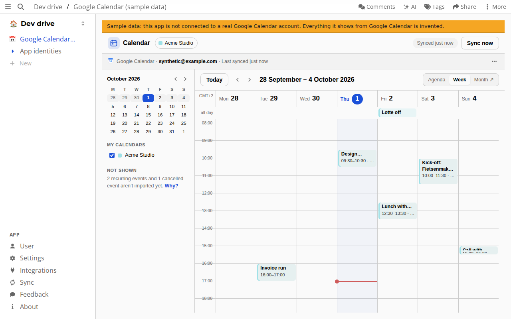
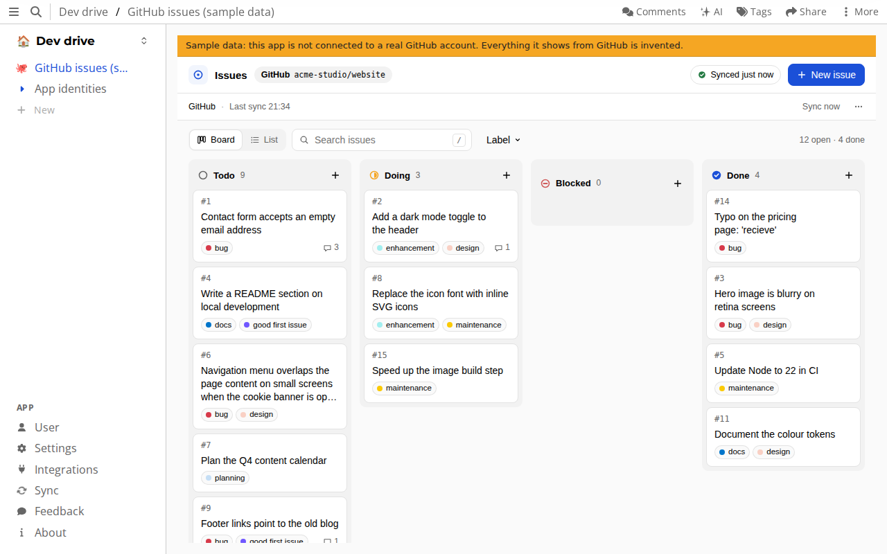
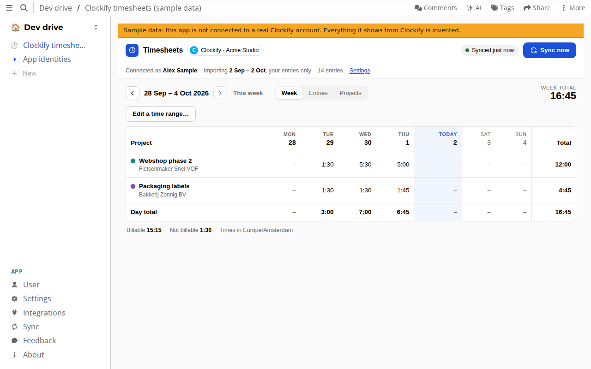
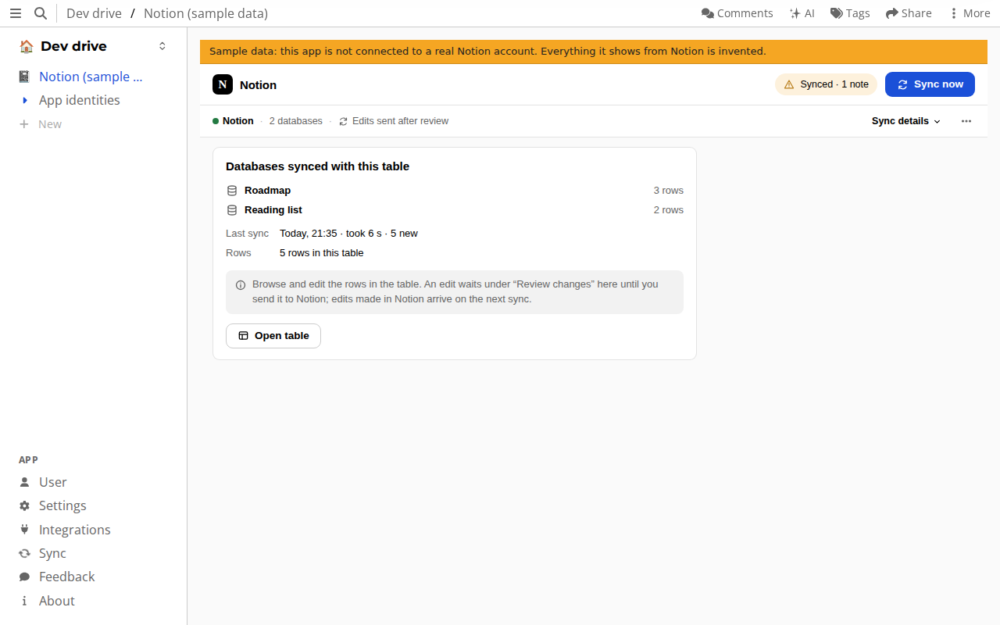
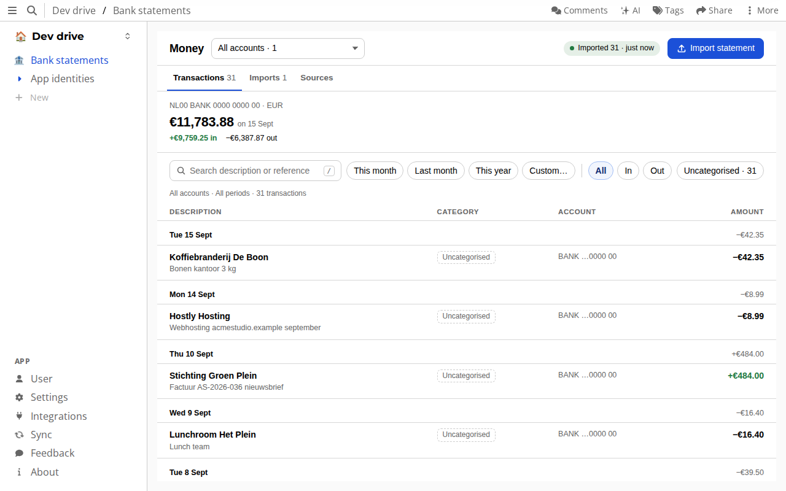
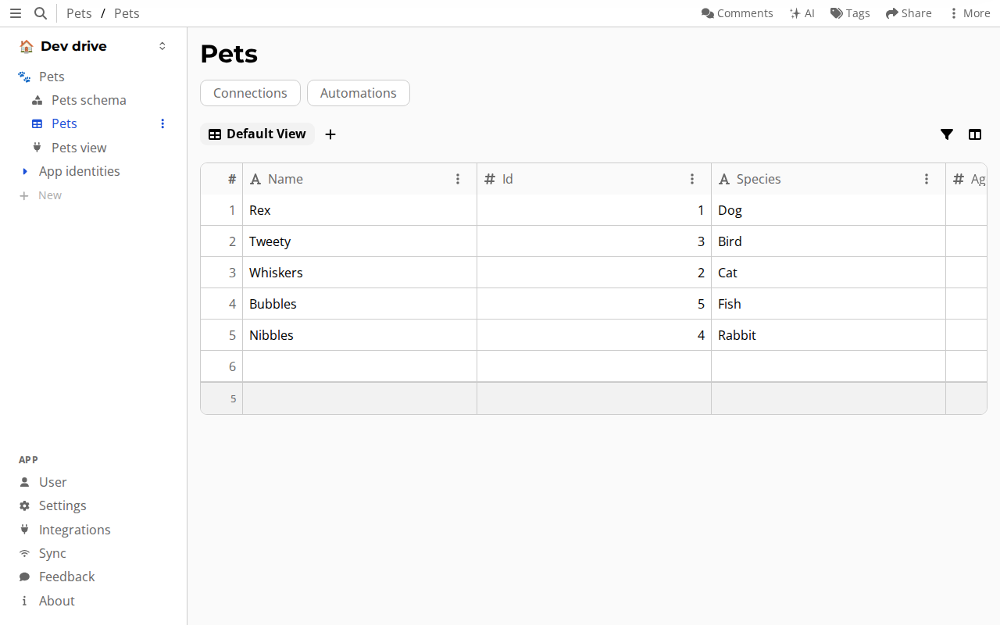

# atomic-plugins

This repo is now the source of truth for all atomic plugins.
https://github.com/ontola/atomic-server/tree/develop/integrations is
deprecated.

- `integrations/` — `ontola/atomic-server`'s former `integrations/` folder.
- `devonian/` — the `devonian` npm package (bidirectional lenses for data
  portability), migrated in from the standalone `localthought/devonian`
  repo with its history intact.
- `reflector/` — the sync-engine/plugin-runtime layer above syncables,
  migrated in from the standalone `localthought/reflector` repo with its
  history intact.
- `syncables/` — the `syncables` npm package (OpenAPI-driven mock server and
  sync client), migrated in from the standalone `localthought/syncables`
  repo with its history intact.
- `overlays/` — OpenAPI Overlays for real providers and the dated `catalog/<date>.json`
  that `integration-proxy/` composes, migrated in from the standalone
  `localthought/overlays` repo with its history intact, and published by
  GitHub Pages at https://ontola.github.io/atomic-plugins/overlays/.
- `openapi-extensions/` — the OpenAPI extension specs (Pagination Schemes,
  CRUD Causality, Authenticated Principal and draft proposals) that
  `overlays/`, `syncables/` and `integration-proxy/` implement, migrated in
  from the standalone `pondersource/openapi-extensions` repo with its
  history intact.
- `integration-proxy/` — the Rust OAuth/API proxy (LocalThought) that drive
  apps reach through atomic-server's `store.proxy`. See its own
  [README](integration-proxy/README.md) and [AGENTS.md](integration-proxy/AGENTS.md).
  To run your own instance instead of atomic.place's, see
  [integration-proxy/SELF_HOSTING.md](integration-proxy/SELF_HOSTING.md).

See [AGENTS.md](AGENTS.md) for how to work in each.

## Plugins

Every plugin here is **experimental**. What each one does is declared, not
verified, until it has current live evidence against the real provider or
peer (see
[`integrations/README.md`](integrations/README.md#one-certification-command)).
[`integrations/READINESS.md`](integrations/READINESS.md) is the full matrix:
runtime, install path, scope and evidence per plugin.
[`integrations/catalog.json`](integrations/catalog.json) holds the catalog
copy.

### Drive apps

A drive app runs inside your Atomic drive, in a sandboxed frame, and keeps
its data in an ordinary table there. It never holds a provider credential:
every call to Google, GitHub and the others goes through the integration
proxy. On the pinned atomic-server, Integrations → Drive apps installs them
from the catalog (with "Show experimental plugins" on). Only Pets is enabled
in the published catalog so far; the others are published with
`enabled: false` until their launch, and while the shared classes' ontology is
on github.io.

<table>
  <tr>
    <td width="50%" valign="top">
      
       <b>🗓️ Google Calendar</b>: one calendar's events, and reviewed edits sent back to Google.
    </td>
    <td width="50%" valign="top">
      
       <b>🐙 GitHub issues</b>: one repository's issues on a board, two-way, every write reviewed.
    </td>
  </tr>
  <tr>
    <td width="50%" valign="top">
      
       <b>⏱️ Clockify</b>: your time entries as a week grid, an entries list and a project list.
    </td>
    <td width="50%" valign="top">
      
       <b>📓 Notion</b>: a sync-status view; the rows themselves are in the table it fills.
    </td>
  </tr>
  <tr>
    <td width="50%" valign="top">
      
       <b>🏦 Bank statements and Money</b>: MT940 and camt.053 imports, read as a ledger.
    </td>
    <td width="50%" valign="top">
      
       <b>🐾 Pets</b>: the demo app. Shown is the table its import fills.
    </td>
  </tr>
</table>

Calendar, GitHub issues, Clockify and Notion were taken on 2026-10-02 against
atomic-server pin `a12b74a`, at 1280×800 in the light theme, with invented
data only, on the user-testing sample accounts
([`usertest/sample-data/`](usertest/sample-data/README.md); hence the yellow
"Sample data" line) at the app versions in the table below. Money (taken
2026-10-01, to be retaken once #295 lands) uses the invented Acme Studio statement
in `integrations/money/fixtures/usertest/`, and Pets the mock proxy's static
fixture. The Notion shot shows the app's status view only. The optional
[`notion-table.png`](docs/screenshots/notion-table.png) (taken with
`... screenshots.mjs notion-table`) shows the sample's table, where the
Status, Tags and Format options are the host's own coloured chips. It hides
the columns the app also adds from Notion's raw page fields, which are
auto-named and empty at 0.4.0, in the host's "Toggle properties" menu first.
To retake them, set up the pinned atomic-server as in
[AGENTS.md](AGENTS.md#shared-pinned-atomic-server-build), then run
`node integrations/tooling/screenshots.mjs [pets calendar issue-tracker money notion timesheets]`.
The checklist is in [#49](https://github.com/ontola/atomic-plugins/issues/49).

| App                              | What it does (declared)                                                                                                                                                                                                                                                        | Status                                                                                                                                                                                                                                                                                                                                                                | Code                                                             |
| -------------------------------- | ------------------------------------------------------------------------------------------------------------------------------------------------------------------------------------------------------------------------------------------------------------------------------ | --------------------------------------------------------------------------------------------------------------------------------------------------------------------------------------------------------------------------------------------------------------------------------------------------------------------------------------------------------------------- | ---------------------------------------------------------------- |
| 🐾 **Pets**                      | A demo: connect the Pets demo provider and import its five pets into a table.                                                                                                                                                                                                  | Enabled in the catalog (0.1.2). Installs from Drive apps. Host E2E against the mock proxy, including an update from an older version.                                                                                                                                                                                                                                 | [`integrations/pets/`](integrations/pets/)                       |
| 🗓️ **Google Calendar**           | Imports one Google calendar's single (non-recurring) events, up to 25,000 per scan, and sends reviewed edits of five fields back with `If-Match`. No creates or deletes in Google.                                                                                             | Published (0.3.1), `enabled: false`. Rows are the shared `event-v1` class, and it can sync a hand-made `event-v1` table. Host E2E against the mock proxy. No live run of the drive app against Google yet.                                                                                                                                                            | [`integrations/calendar/`](integrations/calendar/)               |
| 🐙 **GitHub issues**             | Keeps one repository's issues (title, body, Todo/Doing/Done, comments) on a board, two-way. Every write to GitHub is held for review.                                                                                                                                          | Published (0.3.1), `enabled: false`. Rows are the shared `issue-v1` class, and it can sync a hand-made `issue-v1` table. Host E2E against the mock proxy. No live run of the drive app against GitHub yet.                                                                                                                                                            | [`integrations/issue-tracker/`](integrations/issue-tracker/)     |
| 🏦 **Bank statements** and Money | The importer reads MT940 (up to 512 KB) and camt.053 (up to 5 MB) files, at most 500 transactions per file, and writes nothing before the host's review. The Money app shows the result as a ledger per account and currency, with your own category and note per transaction. | Importer: set up from a release published to the server by hand. Money app: published (0.3.0), `enabled: false`; a catalog install does not give a working app yet, so the screenshot adds it as a view of the importer's table, as its host E2E does. Tested with synthetic statement files only.                                                                    | [`integrations/money/`](integrations/money/)                     |
| ⏱️ **Clockify**                  | Brings your Clockify time entries into a week view and a table, and sends reviewed edits back.                                                                                                                                                                                 | Published (0.6.2), `enabled: false`. Rows are the shared `time-entry-v1` class, and it can sync a hand-made `time-entry-v1` table. Write-back, range edits and conflicts are declared, mock-tested only. Host E2E against the mock proxy. No live run ([#123](https://github.com/ontola/atomic-plugins/issues/123) is open). | [`integrations/timesheets/`](integrations/timesheets/)           |
| 📓 **Notion**                    | Syncs the rows of shared Notion databases into one table, with select, status and multi-select options as the host's own select columns, and sends reviewed edits to existing pages back. A small status view shows the sync. No page creation or deletes.                     | Published (0.4.0), `enabled: false`. Host E2E against the mock proxy. No live run of the writes ([#8](https://github.com/ontola/atomic-plugins/issues/8) is open).                                                                                                                                                           | [`integrations/notion/`](integrations/notion/)                   |
| ✅ **Todoist**                   | Imports the active tasks of a Todoist account into an `issue-v1` table, read-only. A task that left the active list is looked up once: a completed one is closed. Nothing is sent to Todoist.                                                                                  | Published (0.1.1), `enabled: false`. Host E2E on a synthetic fixture; nothing checked against real Todoist ([#99](https://github.com/ontola/atomic-plugins/issues/99), [#46](https://github.com/ontola/atomic-plugins/issues/46)).                                                                                                                                    | [`integrations/issue-tracker/`](integrations/issue-tracker/)     |
| 🐦 **Moneybird**                 | Imports the contacts of one Moneybird administration, read-only.                                                                                                                                                                                                               | Published (0.1.1), `enabled: false`. Host E2E on a synthetic fixture; nothing checked against real Moneybird ([#102](https://github.com/ontola/atomic-plugins/issues/102)).                                                                                                                                                                                           | [`integrations/money/moneybird/`](integrations/money/moneybird/) |

### Importers

Sandbox jobs that turn a file you upload into rows. They run server-side in
AtomicServer's QuickJS sandbox with no network access, and start from the
plugin page's Import tab. Publishing one to a server is still done by hand
([#94](https://github.com/ontola/atomic-plugins/issues/94)).

| Plugin                 | What it does (declared)                                                                                                                    | Status                                                     | Code                                                     |
| ---------------------- | ------------------------------------------------------------------------------------------------------------------------------------------ | ---------------------------------------------------------- | -------------------------------------------------------- |
| 🏦 **Bank statements** | See the drive apps above.                                                                                                                  | Host E2E on synthetic MT940 and camt.053 statements.       | [`integrations/money/`](integrations/money/)             |
| 🌳 **Willow drop**     | Imports a Willow'25 drop file (up to 5,000,000 bytes and 1,000 entries) into a table, after checking each entry's Meadowcap authorisation. | Catalog entry `enabled: false`. Host E2E on fixture drops. | [`integrations/willow-drop/`](integrations/willow-drop/) |

### Server protocol plugins

These let a drive speak an open protocol with other servers. They run as
QuickJS route handlers and have no app screen of their own, so they have no
screenshot. Each needs an AtomicServer built with the `plugin-routes` feature
and started with `--plugin-routes`, which atomic.place is not (see
[Public endpoints need a gated server](integrations/README.md#public-endpoints-need-a-gated-server)).
Several also need atomic-server changes that are not in the current pin; each
README says which.

| Plugin                 | What it does (declared)                                                                                           | Evidence                                                                                                                                                           | Code                                                             |
| ---------------------- | ----------------------------------------------------------------------------------------------------------------- | ------------------------------------------------------------------------------------------------------------------------------------------------------------------ | ---------------------------------------------------------------- |
| **Fediverse**          | One ActivityPub actor per drive: others can find and follow it, receive its public posts and reply.               | Host E2E against a local peer fixture; opt-in e2e against real Mastodon 4.7.3 and Akkoma 3.20.1 on the loopback (2026-10-02). No GoToSocial.                       | [`integrations/fediverse/`](integrations/fediverse/)             |
| **Open Cloud Mesh**    | Receives files shared over OCM 1.5 by servers you allow, into a folder you pick.                                  | Host E2E against an invented peer; opt-in Nextcloud 35.0.1 e2e fails at the pin (the host refuses its ES256 key). No ownCloud or OCIS.                             | [`integrations/open-cloud-mesh/`](integrations/open-cloud-mesh/) |
| **remoteStorage**      | A remoteStorage server (draft-dejong-remotestorage-22) that keeps documents as Atomic Files.                      | Host E2E with remotestorage.js at the pin; opt-in api-test-suite run: 46 of 53 pass, the 7 failures being host gaps.                                               | [`integrations/remotestorage/`](integrations/remotestorage/)     |
| **Willow export**      | Serves selected public resources as one signed Willow drop file.                                                  | Host E2E; no WGPS sync and no live peer.                                                                                                                           | [`integrations/willow/`](integrations/willow/)                   |
| **Solid pod**          | A partial Solid pod: LDP resources, Turtle and JSON-LD, N3 Patch, Solid-OIDC DPoP. Not a conforming Solid server. | Host E2E with `@inrupt/solid-client` against a test issuer.                                                                                                        | [`integrations/solid/`](integrations/solid/)                     |
| **AT Protocol handle** | Makes the drive's host name an AT Protocol handle, with a `did:web` document. Not a PDS.                          | Host E2E on invented host names, resolved by Bluesky's reference identity code, and (opt-in) accepted by the reference PDS on the loopback. No live Bluesky check. | [`integrations/atproto/`](integrations/atproto/)                 |
| **NextGraph**          | Exchanges RDF snapshots between Atomic resources and NextGraph documents, through an operator-run sidecar.        | Host E2E against a local NextGraph sidecar; no sync between brokers.                                                                                               | [`integrations/nextgraph/`](integrations/nextgraph/)             |

### Libraries without a host

None listed at present: the Todoist projection and the Google Calendar and
GitHub issues mapping code are each wrapped by a drive app above.

`integrations/localthought/` is shared tooling, not a plugin: the mock
integration proxy that every E2E lane runs against.
