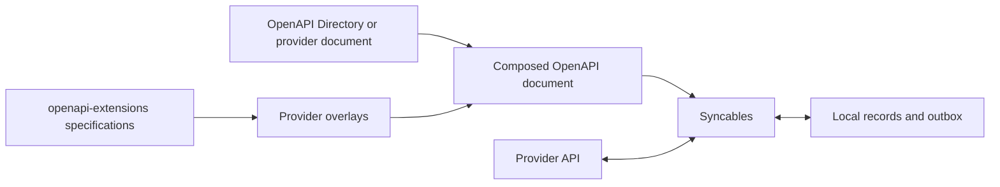

# Syncables

**Give an existing API a local-first interface.** Syncables is a TypeScript
library that joins the pages of API collections into a local copy, lets your
application read and edit that copy, and sends local changes back in the
background. Your application can work with already-synced data while the API
is slow or unreachable. The provider does not need to install Syncables or
change its API.

Use it to build an offline-capable editor, a local dashboard over several
services, or a data import that follows every declared page. It runs in Node
and browsers, with direct HTTP or a custom transport such as integration-proxy.
Supply persistent storage when records and pending writes need to survive a
restart; the default storage is in memory.

## From an API description to a local copy

Syncables builds on three complementary projects:

| Project | What it contributes |
| --- | --- |
| [OpenAPI Directory](https://github.com/APIs-guru/openapi-directory) | Machine-readable descriptions of existing APIs: URLs, operations, parameters and schemas. You can also use a provider's own OpenAPI document or write one for a private API. |
| [openapi-extensions](../openapi-extensions/README.md) | Shared vocabulary for the missing behavior: [Pagination Schemes](../openapi-extensions/spec/pagination-schemes/README.md) describe how to reach the next page; [CRUD Causality](../openapi-extensions/spec/crud-causality/README.md) describes collections, record identities and operation effects. Syncables implements a subset of these specifications. |
| [overlays](../overlays/README.md) | Reusable additions to API descriptions, so collection and pagination metadata can be maintained separately from the provider's document. Dated catalogs pair documents with their overlay revisions. |

These are sources of descriptions and conventions, not three npm packages
you must install. Once you have a composed document, Syncables uses it locally;
it does not look up a directory or catalog on each request. An API whose document
already contains the necessary metadata needs no overlay.



To **local-firstify an API**, describe the collections you want, their stable
identities, pagination and supported writes; choose authentication and storage;
then point your application at `client.list`, `client.get` and the local write
methods. Syncables handles collection traversal, page assembly, refreshes and
the write queue. "Any API" means an API whose needed operations can be expressed
in the supported model: a read-only API gives you a local read-only copy,
and custom mutation protocols may need an adapter.

Start with the [local-first guide](docs/local-first.md): it includes a runnable
offline-edit example, the document/overlay workflow, direct and proxy transports,
persistence and write recovery. The API details below serve as a reference.
This README describes current source, including the **Unreleased** changes;
the guide explains how to run that source before an npm release.

## Usage

For published releases, install with `npm install syncables`. To build the
current source, run these commands from `syncables/` with Node 22:

```sh
npm ci
npm run build:release
```

```ts
import { loadOpenApiDocument, createMockServer, createApiClient } from 'syncables';

const document = await loadOpenApiDocument('./petstore.yaml');

const server = createMockServer(document);
const { url } = await server.listen();

const client = createApiClient(document, { baseUrl: url, credentialPrefix: false });
await client.sync(); // pulls every discovered resource collection into local storage

const pets = await client.list('/pets'); // a local read, with no API request
```

The mock server makes it possible to try the workflow without credentials. It
uses an in-memory CRUD store and synthetic records generated from the schemas.
For a real provider, load its composed document and configure a
[transport and authentication](#transports-and-direct-authentication) instead.
The mock server uses legacy path-pair discovery and does not implement all
metadata-driven behavior of a real provider.

When `components.crudResources` is present, the client and reader use its
collection names, identity bindings and nested collection graph. Without
that metadata, the client retains legacy discovery by paired collection
and item paths, e.g. `/pets` and `/pets/{petId}`; the mock server still uses
that legacy model. The browser reader requires CRUD metadata. This is a
subset of CRUD Causality, not a complete implementation of its write semantics.

## Keeping in sync

`sync()` can be called on a timer: it conditionally re-fetches using
`ETag`/`Last-Modified` (or a fallback comparison against the previous sync
when a server doesn't support conditional requests) and only touches local
storage for items that actually changed.

```ts
const handle = client.startPolling({
  intervalMs: 30_000,
  onSync: (result) => console.log('changed:', result.changed),
  onError: (error) => console.error('sync failed:', error),
});

// later
handle.stop();
```

## Writing

`create`/`update`/`remove` are local-first: they update local storage
immediately and return, then apply themselves against the server in the
background. Confirmed provider state is separate from pending local intent;
refreshes and older write responses replay remaining mutations rather than
replacing newer local edits. Updates use the item's declared PUT, or PATCH
when PUT is absent. Both currently send JSON records, not JSON Patch documents.
An update's response is merged over the record it sent, so a provider that
answers with only some fields (or only bookkeeping such as `updatedAt`) does
not shrink the confirmed record or revert the edit. The trade-off: a field
that the provider removed in that response, rather than omitted, stays in the
local copy until the next refresh, and is sent again in later PUT or PATCH
bodies until then; a strict provider could reject those, for example after a
field rename.

A write the server refuses for good (most 4xx) fails at once, a write whose
credentials are refused (401, 403) pauses all writes until the app renews
them, and other failures retry with exponential backoff, unlimited by
default; set `retry.maxAttempts` to bound attempts. See
[Failure classes](#failure-classes). Unsettled writes are kept in a durable
outbox in the client's storage adapter, so a client built later on the same
storage resumes them (see [Durable outbox and restarts](#durable-outbox-and-restarts)).

```ts
const pet = await client.create('/pets', { name: 'Milo', tag: 'cat' });
// `pet` is already in local storage — the POST to the server is still
// happening (and retrying, if needed) in the background.

client.pendingWrites('/pets'); // writes not yet confirmed by the server
```

Each entry of `pendingWrites()` has a `state`:

| `state` | Meaning | What the client does |
| --- | --- | --- |
| `pending` | Queued, in flight or waiting for a retry | Retries automatically |
| `uncertain` | A create may or may not have reached the server | Nothing, until `resolveWrite` |
| `failed` | The server refused it, or retries stopped at `retry.maxAttempts` | Nothing, until `resolveWrite` (see below) |
| `blocked` | The server refused the client's credentials for it | Sends no write at all, until `authRenewed()` |

Entries carry `attempts`, `lastError` (for an HTTP failure: the path, the
status and up to 200 characters of the response body, whitespace collapsed)
and `lastStatus` (the HTTP status behind `lastError`, absent when `lastError`
does not describe a response).

A new `create`/`update`/`remove` does not drop a failed write. A failed create
holds back later writes to the record, like an uncertain one. A failed update
or delete does not; later writes go ahead, and once one of them settles, it
replaces the fields it set in the failed update. A failed update with no
fields left, and a failed delete followed by any settled write, are dropped.
Whatever is left stays listed, and visible locally, until `resolveWrite`.

### Failure classes

A write the server answers with a non-2xx status is classified. The defaults
(`defaultWriteFailureClass`, exported) are:

| Response | Class | What the client does |
| --- | --- | --- |
| 404 or 410 to a delete | `satisfied` | The record is already gone, so the delete settles as if it had succeeded |
| 401 | `auth` | The write becomes `blocked` and the client stops sending writes (below); no attempt is counted |
| 403 with `Retry-After` or `x-ratelimit-remaining: 0` | `retry` | A rate limit, as GitHub sends it |
| Other 403 | `auth` | As 401, except for a request sent after `authRenewed()` before any response showed the renewed credentials accepted (below): then `permanent` |
| 408, 425, 429 | `retry` | Backoff retry, or the `Retry-After` delay |
| Every other 4xx: 400, 404 or 410 to a create or update, 405, 409, 413, 415, 422, ... | `permanent` | The write becomes `failed` at once, after 1 attempt |
| Anything else: 5xx, and a 1xx or 3xx the transport passed on | `retry` | Backoff retry, or the `Retry-After` delay; a create's 5xx other than 503 becomes `uncertain` without a usable idempotency key ([Uncertain creates](#uncertain-creates)) |

Failures without a status keep their earlier handling: a transport that
throws (`uncertain` for a create without a key, otherwise retried), a 2xx
with an unusable body (`uncertain` for a create), and an error before the
request was handed to the transport, such as an `authenticate` adapter that
throws (retried with backoff).

`retry` counts an attempt and sends the write again after the backoff delay
(`retry.baseDelayMs`, doubled per attempt, at most `retry.maxDelayMs`). A
`Retry-After` header (delay-seconds or an HTTP date) can only lengthen that
wait: the delay is the longer of the backoff and the `Retry-After`, which
may exceed `retry.maxDelayMs` but is cut to `retry.maxRetryAfterMs`
(default 3600000, 1 hour). `Retry-After: 0`, a date in the past, or a server
clock behind the client's therefore waits the backoff, so they cannot cause
a tight loop. The cap is a trade-off: a provider that asks for more than an
hour is asked again after an hour, which it may answer with another 429;
raise the cap to wait as long as such a provider asks, at the cost of a queue
that can stay held that long. A value that is neither delay-seconds nor a
date (such as `1.5`) is ignored. `retry.maxAttempts` applies to `retry`
failures. The delay is not stored; after a restart the first resend is
immediate.

`permanent` counts an attempt and makes the write `failed` at once, as if
`retry.maxAttempts` were reached: a failed create holds back the writes
queued behind it, a failed update or delete joins the record's failed writes
while later writes go ahead, and `resolveWrite` retries or discards them.
Only the write at the head of its record's queue is sent, so a failed write
is always older than the record's queued writes.

A 404 or 410 to a delete is the one default that settles a write without a
2xx. If the delete path itself is wrong (a misconfigured document), deletes
then settle locally and the next `sync()` brings the records back; classify
such responses as `permanent` to catch that.

Set `classifyWriteFailure` to change the classes. It receives the write's
`type`, the HTTP `method`, `status`, lower-cased `headers`, the response
`body`, `resource`, `id` and `afterRenewal`, and returns `'retry'`,
`'permanent'`, `'auth'` or `'satisfied'`. A classifier that throws or returns
another value gets the default class; `satisfied` for a create or update
counts as `permanent`.

```ts
import { createApiClient, defaultWriteFailureClass } from 'syncables';

const client = createApiClient(doc, {
  classifyWriteFailure: (failure) =>
    // This provider answers 409 while a record is locked for a moment.
    failure.status === 409 ? 'retry' : defaultWriteFailureClass(failure),
});
```

#### Refused credentials

An `auth` failure stops every write of the client, for every record and
collection: a client has one server URL and one set of credentials (one
`transport`, `credentials` and `authenticate`), so a refusal is taken to
apply to all of its writes. The write that met it becomes `blocked`, without
counting an attempt; the other writes stay `pending` but are not sent, and
writes made meanwhile are queued as usual and visible locally. A request
already sent completes, and its write is marked `blocked` too if it is
refused. A write whose in-flight mark was still being stored when the block
began is not sent and keeps its attempt count. Reads (`sync()`) are not
affected by the block.

```ts
const client = createApiClient(doc, {
  authenticate,
  onAuthBlocked: ({ status, lastError, resource, id }) => {
    // ask the user to sign in again, then:
    renewToken().then(() => client.authRenewed());
  },
});
client.authBlocked(); // { status, lastError, resource, id } while blocked
```

`authRenewed()` makes the `blocked` writes `pending` again and resumes every
queue in its order; it does nothing when the client is not blocked. The
client cannot tell by itself that credentials were renewed: the
`authenticate` adapter returning a request does not show that the server
accepts it. Do not call `authRenewed()` from `onAuthBlocked` without
renewing: a write refused again blocks the client again, one request per
call. After a renewal, a 401 blocks again. A 403 (without rate-limit
headers) fails its write instead of blocking, if it answers a request sent
after the renewal and before any response showed the renewed credentials
accepted, so a permission that new credentials do not grant cannot hold all
writes back. Accepted means: a response to a request sent after the latest
renewal that is not a refusal, that is a 2xx or a failure classified
`retry`, `permanent` or `satisfied`, except a failure that the classifier in
use (`classifyWriteFailure`, or the defaults) calls `auth` when asked again
with `afterRenewal: false`, such as the 403 that this rule makes
`permanent`. A refusal never counts as acceptance, so several writes the
renewed credentials may not make all fail rather than block again. For a
failure of a request sent after a renewal that it does not call `auth`, a
custom classifier is therefore called a second time, with `afterRenewal:
false`; one that returns a class other than `auth` regardless of
`afterRenewal` makes that response count as acceptance. Whether a request
counts as sent after the renewal is decided when it is sent, not when its
answer arrives. A 401
or 403 for a request sent before the latest renewal is sent again at once,
without counting an attempt.

`resolveWrite` `discard` drops a blocked write (a blocked create together
with the writes queued behind it, as for an uncertain one) and leaves the
client blocked; the record's later writes stay queued. `retry` on a record
whose queue starts with a blocked write throws unless the record also has
failed or waiting writes: it then retries the failed writes behind the queued
ones, or stops the waiting updates from waiting for a refresh; a blocked
write itself is resent only by `authRenewed()`.

For an `authenticate` adapter that renews tokens by itself, set
`onAuthFailure: 'retry'`: an `auth` failure is then retried with backoff like
a `retry` failure (counting attempts, `retry.maxAttempts` applies), nothing
is blocked and `onAuthBlocked` is not called. A client with `'retry'`
restored from an outbox stored while blocked drops the stored block and
sends the `blocked` writes as `pending` ones. The default is `'block'`.
Under either setting, a create that a classifier calls `auth` but that may
have been applied (a 5xx other than 503) becomes `uncertain` without a
usable idempotency key, instead of being resent.

The block is stored in the durable outbox. A client restored from a blocked
outbox is blocked, calls `onAuthBlocked` once the restore is done, and sends
no write before `authRenewed()`. Whether credentials were just renewed is
not stored, so after a restart a 403 blocks again. While blocked, `sync()`
calls do not count
towards failing a restored update that waits for a refresh; a complete
refresh still releases it, and after `authRenewed()` it is sent on the
newest confirmed record.

### Refresh during a pending update

A refresh (`sync()`) never hides a pending local edit: the visible record is
the newest confirmed remote record with the pending changes replayed on top.
When a refresh shows that a field with a pending update also changed remotely
(its remote value differs from the value the client had confirmed when the
edit was made, or when an earlier write to that field settled, and from every
value this client has queued, or holds as failed, for that field), the client
records a conflict.
A refresh that shows an earlier queued edit applied, before or after its
response arrives, is not a conflict.
The local value stays visible, the queued write still sends it (local wins on
acknowledgement), and the conflict is observable in two ways:

```ts
const client = createApiClient(doc, {
  onConflict: ({ resource, id, field, base, remote, local }) => {
    // called once per newly observed remote value
  },
});
client.pendingWrites('/pets')[0]?.conflicts; // [{ field, base, remote, local, ... }]
```

The conflict is listed until its write settles or is discarded, and is
dropped if a later refresh shows the remote value equal to the local one. To
keep the remote value instead, call `update` again with it. Not covered: a
remote deletion under a pending update (the edit stays visible and is sent; a
PUT then carries the last confirmed copy of the record with the edit on top),
conflicts
that arrive only in a write's own response, and deletes. The remote-deletion
case remains open in [#260](https://github.com/ontola/atomic-plugins/issues/260);
only restored updates handle it, as below.

### Uncertain creates

POST is not idempotent in general, so the client does not resend a create
whose outcome it cannot know. A create becomes `uncertain`, and is not retried
automatically, when:

- the transport throws, so no response arrived (the request may have been
  processed). An `authenticate` adapter that throws before the request is
  handed to the transport does not count: nothing was sent, so the create
  keeps the ordinary retry;
- the server answered 2xx but the body is not JSON or has no record identity;
- the server answered a 5xx other than 503, which can follow a committed create
  (a gateway error or timeout, for example).

A 503 or 429 conventionally means the request was not processed; those keep
the automatic backoff retry. Other 4xx responses mean it was refused; they
follow [Failure classes](#failure-classes), and most fail at once. Updates
(PUT, or PATCH with the full record) and deletes are resent as before. This
classification is a convention, not a guarantee: a provider that commits a
create and then answers 503 can still get a duplicate.

Writes to the same record queue behind an uncertain create. The local record
stays visible. Settle it with `resolveWrite`:

```ts
await client.sync(); // look for the record on the server
const local = client.pendingWrites('/pets').find((w) => w.state === 'uncertain');
// The app decides what "the same record" means, for example by field values:
if (local)
  await client.resolveWrite('/pets', local.id, { action: 'confirm', id: 'server-id' });
// or: { action: 'retry' }   send the POST again (may duplicate)
// or: { action: 'discard' } drop it and the writes queued behind it
```

`confirm` moves the local record and its queued follow-up writes to the server
id without sending anything. `retry` and `discard` also apply to `failed`
writes. A failed create behaves like an uncertain one. Failed updates and
deletes of the record are retried or discarded together. A retried one is
queued behind any newer writes to the record, without the fields those set, so
an older edit cannot overwrite a newer one. `retry` drops the failed writes
that newer queued writes make obsolete (a failed delete, once any newer write
is queued); if none are left, it throws and changes nothing.

When the create operation (or its path item) declares an `Idempotency-Key`
header parameter, the client sends a fresh key with each create and reuses it
on every retry, and an uncertain create is retried automatically instead. Set
`idempotencyKeyHeader: 'X-Some-Header'` to use another header for every create
when the provider documents one elsewhere, or `false` to never send one. Whether
the provider actually deduplicates on that key is the provider's contract; it is
not verified here. A 2xx response with an unusable body stays `uncertain`
even with a key.

### Durable outbox and restarts

When a `storage` adapter is passed, the client keeps every unsettled write in
one record of it: namespace `syncables:outbox`, id `outbox`. Without
`storage`, the default `InMemoryStorageAdapter` ends with the client, so no
outbox is kept. The outbox holds, per record, the queued writes in order, the
failed writes, each write's state, attempts and last error, the conflict
bases and conflicts of pending updates, idempotency keys, the confirmed remote
record the writes are replayed on, local ids of creates the server has not
confirmed (with the writes queued behind them), each write's last HTTP status,
and the block while the server refuses the client's credentials. A client built on the same
storage restores it before anything else:

```ts
const client = createApiClient(doc, { storage, transport });
await client.ready(); // restores the outbox; other async methods wait for it too
client.pendingWrites(); // pending, uncertain and failed writes from before the restart
```

Pending writes then resume in their stored order per record (the backoff
delay is not stored; the first resend is immediate), with one exception:
a restored update waits for a `sync()` that reads its collection completely.
Updates send the whole record, and the confirmed record stored before the stop
may be old: sending it would overwrite remote changes to fields the update
never touched. After the refresh the update is replayed on the current remote
record and checked for conflicts (`onConflict`) like any pending update.

If that refresh does not return the record (deleted remotely, or filtered out
of the read), a restored update that would be sent as a PUT, and is at the
head of its record's queue, becomes `failed` with `lastError` "not in the
refreshed collection" instead of sending only its own fields as the whole
record. Failing the head keeps the order (failed writes are always older than
queued ones), and the next restored update of the record, now the head, fails
the same way, so several offline edits of a vanished record all fail and none
is sent. The edit stays visible on the last confirmed record, and a later
`update` of the record is built on that record, not on the failed edits.
"Last confirmed record" is the newest copy a refresh or a write response
confirmed: a record that reappears with other values and then vanishes again
leaves those newer values as the base, never an older copy.
`resolveWrite` `retry` sends them on that record, which any of the record's
writes may have kept, including for an older failed write; when the client
never had one, it sends the update's fields as they are, which a PUT applies
as the whole record. A PATCH update is sent (it carries only its changes). A
restored update queued behind a write that is not an update (a delete, say)
is released and sent once that write settles.

While it waits, its `pendingWrites()` entry is `pending`
with `awaitingRefresh: true` (only pending entries carry it), and writes
queued behind it wait too. A refresh during which a write to the same record
settles does not release it; writes to other records of the collection do not
matter. Updates queued behind a restored create do not wait: they replay on
the create's response. Restored creates and deletes do not wait.

A waiting update can be settled with `resolveWrite`: `retry` sends it now, on
the confirmed record stored before the stop, and `discard` drops it (writes
queued behind it stay). After three `sync()` calls that ran without releasing
it while it was at the head of its record's queue (the collection failed or
was incomplete, or a write to the record kept settling), it becomes `failed`
with `lastError` "Waiting for a complete refresh of <collection>", so a
collection that never reads completely cannot hold it back unseen. Writes
queued behind it then go ahead. A waiting update behind other queued writes
does not count misses until it is the head, since failing it there would make
a failed write newer than queued ones. `retry` resets the count.

Uncertain and failed writes stay listed, visible locally and resolvable with
`resolveWrite`, and are not resent. Retrying a restored failed update sends it
at once, as does retrying any failed write of a record whose queued updates are
waiting. `pendingWrites()` lists restored writes only after
`ready()` resolves. If reading the outbox fails (a storage error), `ready()`
and the methods that wait for it reject, and the next call tries the restore
again.

The outbox is written as a whole, in one `put`, at each step below, and
calls are serialized, so the stored record is always one consistent state.
What a process stop between steps leaves:

| Step | A stop before the next step leaves | On restart |
| --- | --- | --- |
| 1. `create`/`update`/`remove` stores the outbox with the write | Nothing recorded, nothing sent; the call had not resolved | Nothing to do |
| 2. The visible record is updated, the call resolves | The write is recorded; the visible record may be stale | Visible records of every stored write are rebuilt |
| 3. The outbox marks the write as in flight, then the request is sent | The request may or may not have reached the server | See below |
| 4. The outcome is stored (settled write removed, follow-ups moved to the server id) | The visible record may still be under the local id | The stored list of records to rebuild is finished |

A write found marked in flight on restart counts as one failed attempt, with
`lastError` saying the process stopped. A create without an idempotency key
becomes `uncertain`: it is not resent, so a create the server did apply is not
duplicated, and `resolveWrite` confirms, retries or discards it as for any
uncertain create. A create with a stored idempotency key is resent with that
key, but only if the client can still send it: when the current document no
longer declares the header, or `idempotencyKeyHeader` is `false`, the create
becomes `uncertain` too. Deletes are resent, and updates (PUT, or PATCH with
the full record) are resent after the refresh described above. If the
restored attempt reaches `retry.maxAttempts`, the write becomes `failed`
instead (a create without a usable key stays `uncertain`). If storing the
in-flight mark fails, the request is not sent; that counts as a failed
attempt and is retried with backoff.

So the worst case after a stop is `uncertain`, not a duplicate or a silent
loss. The limits of that claim:

- A `create`, `update` or `remove` call that had not resolved may or may not be
  in the outbox. Check `pendingWrites()` after `ready()` before repeating it.
  If storing the outbox fails, the call rejects, the write is not queued, and
  no other call's store includes it: a write reaches storage, as outbox or as
  visible record, only once its own first store has succeeded.
- After the write is queued, a failed outbox store (after an outcome, in
  `sync`, or in `resolveWrite`) does not fail the operation: the stored record
  stays at the previous state until the next successful store, which writes
  the whole state again. A stop in that window restores that older state, at
  worst a write marked in flight (handled as above) or a resolution to redo.
- The guarantee is only as strong as the adapter's `put`: it must store the
  whole record or nothing, and keep what it acknowledged.
- The whole outbox is serialized and stored at each step (about three stores
  per write, more on retries and id remaps). Its size is one copy of each
  written record's confirmed state (or last known copy) plus, per unsettled
  write, its own changes and bookkeeping: measured on 2026-10-02 with a
  10 KB record, 1 queued update gave a 10.3 KB outbox and 20 gave 12.3 KB
  (about 107 bytes per extra small update). Bytes written per step therefore
  grow with the number of unsettled writes and records. Throughput was not
  measured; it is meant for hundreds of unsettled writes, not a bulk import.
- Only one client may use a storage at a time. Two clients on one outbox (two
  tabs, say) overwrite each other's record and may both send a write; there is
  no lock.
- An idempotency key prevents a duplicate only if the provider honours it.
- A restored update is sent only after a refresh, but the provider can still
  change the record between that read and the request, as without a restart.
  A resent delete that was already applied usually gets a 404 or 410, which
  settles it (see [Failure classes](#failure-classes)); any other answer is
  classified as usual.
- Not stored: the last synced snapshot and conditional-request cache (the
  next `sync()` reads everything again) and confirmed records without writes.

The record has a `version` (now `1`). Storage without an outbox record, such
as storage written by an earlier syncables, starts with an empty outbox. A
record with another version is left unchanged and `ready()` rejects, as do
the methods that wait for it, rather than overwrite writes this client cannot
read. Entries for a collection the current document lacks (queued writes and
pending rebuilds), and entries that do not parse, are kept and written back
unchanged; the next client tries them again. The write field `lastStatus`,
the state `blocked` and the top-level `authBlock` were added within version
`1`; a stored `authBlock` that does not parse still blocks the client
(`status` 0) until `authRenewed()`. Set `outboxNamespace` to
store the outbox under another namespace (it must not equal a collection
name), or to `false` to keep writes in memory only.

## One engine in Node and browsers

The Node `syncables` and browser `syncables/browser` entries both export
`createApiClient`, `readCollections`, `readPlatform` and the same transport
contract. `readCollections` assembles unmodified provider records per bound
collection and marks each result `complete` or incomplete with an error.
`readPlatform` uses it and adds ontology/datatype interpretation. The local
replica uses it to refresh storage. `paginate` (Node: `paginateOperation`)
and `client.paginate` share the same page walker.

| Capability | Node entry | Browser entry |
| --- | --- | --- |
| One-off raw/typed collection reads | Yes | Yes |
| Local-first client, CRUD and polling | Yes | Yes |
| Custom transport or direct fetch for the client | Yes | Yes |
| Constructor credentials and auth adapters | Yes | Yes |
| Environment credential fallback | Yes | No |
| Optional raw read-response storage hook | Yes | Yes |
| Mock HTTP server and file/YAML loaders | Yes | No |

An explicit `baseUrl` overrides the document's server. Paths are appended to
its base path, matching the browser reader (for example, base `/v3` plus
`/calendars`). Legacy callers using an origin-only base keep the same URLs.

```ts
import { createApiClient } from 'syncables/browser'; // also exported by 'syncables'

const client = createApiClient(document, {
  transport: hostTransport, // proxy, direct HTTP, or a deterministic test transport
  storage: recordStorage,  // optional; default is in memory
  constants: { workspaceId: 'example-workspace' }, // required root bindings, if any
});
await client.sync();
const events = await client.list('events', { calendarId: 'example-calendar' });
await client.update('events', 'example-event', { summary: 'Changed' }, {
  calendarId: 'example-calendar',
});
```

Collection names identify metadata-driven resources; a unique collection URL
is also accepted. Legacy resources retain their path names. Per-call context
binds nested collections; `constants` supplies defaults. The storage resource
key for a nested collection is `JSON.stringify([collectionName, contextValues])`,
where values follow the collection's path-variable order. Equal IDs under
different parents stay separate. Collection names must be globally unique.
CRUD metadata is authoritative when supplied. Creates use a declared POST
on a GET collection or an explicit POST `x-crud` create operation; a POST
list is never automatically treated as a create. Unsupported writes are
refused before changing local storage.

Client reads now use the same default request/record/time limits and bounded
429 handling as the reader, replacing the old silent 50-page stop. A failed,
malformed or budget-limited collection does not replace or prune its local
copy; other complete collections may still refresh before `sync()` rejects.
`readCollections` and `readPlatform` retain partial results for one-off imports.
Full-list absence still follows the existing client deletion rule; reaching
the last page does not prove the provider offered a consistent snapshot.

## Transports and direct authentication

`transport` handles every client GET/POST/PUT/PATCH/DELETE. Without it, the
client adapts `options.fetch` or global `fetch`; supplying both `transport`
and `fetch` is an error. Integration-proxy is optional. A transport that
already authenticates needs no credential options.

```ts
import { apiKeyAuth, createApiClient } from 'syncables';

const client = createApiClient(document, {
  credentials: { apiKey: 'application-key' },
  authenticate: apiKeyAuth('X-API-Key'), // or apiKeyAuth('key', 'query')
});
```

The Node constructor falls back to `SYNCABLES_API_KEY`,
`SYNCABLES_OAUTH_CLIENT_ID`, `SYNCABLES_OAUTH_CLIENT_SECRET` and
`SYNCABLES_ACCESS_TOKEN`. Explicit fields win over environment values.
`credentialPrefix: 'SECOND_'` selects a different prefix;
`credentialPrefix: false` disables fallback. `credentialsFromEnv(explicit,
prefix)` is also exported by the Node entry. The browser entry never reads
environment variables.

`bearerAuth` adds a supplied `accessToken`. For OAuth, supply
`authenticate(request, credentials)`: it receives the constructor/environment
`clientId` and `clientSecret` and returns an authenticated request, possibly
after obtaining/refreshing a user token. OAuth consent, grant selection and
token persistence are the adapter's responsibility; loading application
credentials alone does not log a user in. Credentials without an authentication
adapter are rejected. Keep confidential client credentials in server-side
configuration. Authentication happens after the data-read capture boundary.

## Optional raw read-response storage

```ts
const client = createApiClient(document, {
  transport,
  storeResponse: async (response) => responseArchive.append(response),
});
```

`storeResponse` also works on `readCollections`, `readPlatform`, and standalone
`paginate`. It is awaited before parsing a response and receives the original
response body text, pre-authentication URL/method/list request body, status,
receive time and these response headers when present: Content-Type, ETag,
Last-Modified, Link and Retry-After. It captures each read response, including
429 attempts, errors and actual 304 responses; the client's cached body is
used only for collection assembly. It does not capture write or OAuth-token
responses. No request headers, cookies or authorization response headers are
saved. A supplied transport must return provider responses in this contract;
Syncables cannot recover information the transport already transformed.

The caller supplies storage and retention (latest responses or history).
The body remains the text returned by the transport, before JSON parsing,
field filtering or date conversion; it is not original HTTP wire bytes. A
capture failure fails that collection read. Raw archives do not persist the
mutation queue or provide an automatic replay/resume mechanism.

## Reading in a browser: `syncables/browser`

`syncables/browser` provides the shared reader and local replica for code
that runs in a browser or a sandboxed iframe. It imports no Node built-ins and no
`js-yaml`. The one-off reader takes a `Transport` function, e.g. a plugin
host's `request()` into an integration proxy; the client accepts that same
transport or direct fetch. A test bundles it with esbuild `platform: 'browser'`
and fails on any Node built-in import. It does not include the mock
server, environment loader or file-path loaders, so pass documents and
overlays as parsed objects.

```ts
import {
  prepareDocument,
  describePlatform,
  readPlatform,
  type Transport,
} from 'syncables/browser';

const document = prepareDocument(openapiJson, [paginationOverlay, crudOverlay]);
describePlatform(document); // { parameters, collections, upstream }

const transport: Transport = async ({ url, method, headers, body }) =>
  host.request({ path: url.pathname + url.search, method, headers, body });
// -> { status, headers, body } with the body as text

const { records, ontology, errors } = await readPlatform(document, {
  platform: 'notion',
  constants: {}, // values for describePlatform(document).parameters
  transport,
});
```

- **Collections** come from `components.crudResources` (the
  [CRUD Causality Extension](https://github.com/ontola/atomic-plugins/tree/main/openapi-extensions/spec/crud-causality),
  usually added by an overlay). A nested collection runs once per parent
  record, with its path variables filled in through `identity.bindings`. On a
  collection, `x-list-query` adds fixed query parameters, `x-list-method: POST`
  lists with a POST instead of a GET, and `x-list-body` adds fixed JSON body
  fields.
- **Pagination** follows the operation's pagination scheme: page numbers or
  offsets, page tokens or cursors, and next links in the body or a `Link`
  header. A cursor declared in `request.bodyFields` travels in the JSON body
  of a POST. Notion's `/v1/search` and `/v1/databases/{id}/query` work this
  way (`start_cursor` in the request, `next_cursor` in the response). A next
  link to another origin, or a page that repeats, stops that collection with
  an error.
- **Records and ontology**: `deriveOntology` makes one class per resource and
  one property per field, typed with Atomic Data datatype URLs. Each record's
  `values` are keyed by property shortname, and `date-time` strings are
  converted to epoch milliseconds.
- **Limits** (`DEFAULT_READ_LIMITS`): 10,000 requests, 5,000 records and 30
  minutes per read, plus at most 3 retries of a 429 per request, each after
  its `Retry-After`. When a limit is reached, the read stops. It keeps the
  records read so far and reports the stop in `errors`.

`paginate(document, { transport, path, method, pathParams, query, body,
pageSize })` walks every page of one operation, without `crudResources`.
The main `syncables` entry exports the same functions, with `paginate`
renamed `paginateOperation` so it doesn't clash with `ApiClient.paginate`.

## Changelog

- **Unreleased**: Shared browser/Node local-first client, resource traversal
  and pagination; injected read/write transports; constructor and Node
  environment credentials with supplied auth adapters; optional original
  read-response storage; scoped nested collections and POST lists; pending
  intent preserved during refresh and older acknowledgements; incomplete
  collections no longer prune the local replica. `pendingWrites()` entries
  gain `state` and `conflicts`; same-field refresh conflicts are reported
  (`onConflict`); ambiguous creates become `uncertain` instead of being
  resent, with `resolveWrite` to retry, discard or confirm them, and
  `Idempotency-Key` retries (`idempotencyKeyHeader`). Unsettled writes are
  kept in a durable outbox in a supplied storage adapter (`syncables:outbox`,
  `outboxNamespace`) and resumed by a later client on the same storage
  (`ready()`); a create in flight when the process stopped becomes
  `uncertain`. With `storage`, `create`/`update`/`remove` store the outbox before they
  resolve, and the request leaves after one more outbox store. A restored
  update waits for a `sync()` of its collection (`awaitingRefresh`).
  Write failures are classified (`classifyWriteFailure`,
  `defaultWriteFailureClass`): most 4xx fail at once instead of retrying,
  a 404 or 410 to a delete settles it, and a 401 or 403 makes the write
  `blocked` and stops all writes until `authRenewed()` (`authBlocked()`,
  `onAuthBlocked`, `onAuthFailure: 'retry'` to keep retrying instead).
  `Retry-After` lengthens the retry delay up to `retry.maxRetryAfterMs`
  (default 1 hour). `pendingWrites()` entries
  gain `lastStatus`, and `lastError` includes a response body excerpt.

- **0.18.0**: Adds the `syncables/browser` entry point: a browser-safe read
  path with an injected transport. Adds request-body pagination, with
  `buildBody` and body-field `offset`/`page` roles in `nextCursor`.
  `applyOverlay` moves to a module without file-system access. The Node API
  is unchanged, and `syncables` also exports the read-path functions.

## NLnet milestone 1

This package is the reference implementation for
[milestone 1](https://github.com/tubsproject/syncables/blob/main/nlnet-milestones.md#1-syncables)
of the project's NLnet grant, which is split into two parts:

- **Part a) Read-only version** — `createApiClient`'s [`sync()`/`paginate()`](#keeping-in-sync)
  pull a full local-first copy of a resource collection (walking pagination in
  full, then re-fetching conditionally on later calls) into a pluggable
  `StorageAdapter`, from nothing but the OpenAPI document — see `discoverResources`
  (`src/resources/discover.ts`) for how "syncable" resources are found in it.
- **Part b) Full bidirectional version** — the [`create`/`update`/`remove`](#writing)
  methods make that copy writable, not just readable: each write lands in local
  storage immediately, then applies itself against the server in the background
  through a per-record retry queue (`src/client/client.ts`), so the local
  copy can be both pulled *and* pushed, as the milestone describes.

## Generative AI use

This code is open source and is authored and maintained by Michiel de Jong,
using Claude Code and Codex as tools. Michiel directs development and authorizes
merges; the session logs record when he delegates review and merge decisions.
Lockfiles are produced by npm and pnpm.
This work was [funded by NLNet](https://nlnet.nl/project/TUBS/).

syncables is developed with **Claude Code** (Anthropic) and **Codex** (OpenAI).
The maintainer directs design and decides how changes are reviewed, tested and
merged. Explicitly delegated agent review and merge decisions are recorded in
the corresponding session log.

As an NLnet-funded project, it records AI-assisted work with reference to
[NLnet's Generative AI policy](https://nlnet.nl/foundation/policies/generativeAI/):

- Commits produced with AI assistance carry a `Claude-Session: <url>`
  trailer identifying the session that produced them. The legacy trailer name
  is retained for compatibility; Codex commits also carry `Codex-Session`,
  and the log names the actual tool/model. Codex session links may be local
  `codex://threads/` links rather than public transcripts.
- [`docs/ai-logs/`](docs/ai-logs) holds prompt/output disclosure logs for
  sessions going forward, redacted for secrets and personal information, per
  the policy's terms for a project that was already ongoing before the
  policy took effect (no retroactive backfill of every past session; known
  historical session links are indexed as pending in
  [`docs/ai-logs/pending-historical-sessions.md`](docs/ai-logs/pending-historical-sessions.md)).
- AI-drafted content is identified as assisted work; the disclosure log
  records the maintainer's review or delegation and the validation performed.
