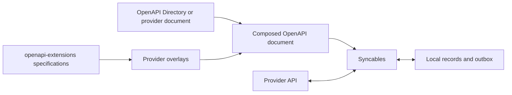

# Syncables

**Give an existing API a local-first interface.** Syncables is a TypeScript
library that joins the pages of API collections into a local copy, lets your
application read and edit that copy, and sends local changes back in the
background. Your application can work with already-synced data while the API
is slow or unreachable. The provider does not need to install Syncables or
change its API.

Use it to build an offline-capable editor, a local dashboard over several
services, or a data import that follows every declared page. It runs in Node
and browsers, with direct HTTP or a custom transport such as integration-proxy.
Supply persistent storage when records and pending writes need to survive a
restart; the default storage is in memory.

## From an API description to a local copy

Syncables builds on three complementary projects:

| Project | What it contributes |
| --- | --- |
| [OpenAPI Directory](https://github.com/APIs-guru/openapi-directory) | Machine-readable descriptions of existing APIs: URLs, operations, parameters and schemas. You can also use a provider's own OpenAPI document or write one for a private API. |
| [openapi-extensions](../openapi-extensions/README.md) | Shared vocabulary for the missing behavior: [Pagination Schemes](../openapi-extensions/spec/pagination-schemes/README.md) describe how to reach the next page; [CRUD Causality](../openapi-extensions/spec/crud-causality/README.md) describes collections, record identities and operation effects. Syncables implements a subset of these specifications. |
| [overlays](../overlays/README.md) | Reusable additions to API descriptions, so collection and pagination metadata can be maintained separately from the provider's document. Dated catalogs pair documents with their overlay revisions. |

These are sources of descriptions and conventions, not three npm packages
you must install. Once you have a composed document, Syncables uses it locally;
it does not look up a directory or catalog on each request. An API whose document
already contains the necessary metadata needs no overlay.



To **local-firstify an API**, describe the collections you want, their stable
identities, pagination and supported writes; choose authentication and storage;
then point your application at `client.list`, `client.get` and the local write
methods. Syncables handles collection traversal, page assembly, refreshes and
the write queue. "Any API" means an API whose needed operations can be expressed
in the supported model: a read-only API gives you a local read-only copy,
and custom mutation protocols may need an adapter.

Start with the [local-first guide](docs/local-first.md): it includes a runnable
offline-edit example, the document/overlay workflow, direct and proxy transports,
persistence and write recovery. The API details below serve as a reference.
This README describes current source, including the **Unreleased** changes;
the guide explains how to run that source before an npm release.

## Usage

For published releases, install with `npm install syncables`. To build the
current source, run these commands from `syncables/` with Node 22:

```sh
npm ci
npm run build:release
```

```ts
import { loadOpenApiDocument, createMockServer, createApiClient } from 'syncables';

const document = await loadOpenApiDocument('./petstore.yaml');

const server = createMockServer(document);
const { url } = await server.listen();

const client = createApiClient(document, { baseUrl: url, credentialPrefix: false });
await client.sync(); // pulls every discovered resource collection into local storage

const pets = await client.list('/pets'); // a local read, with no API request
```

The mock server makes it possible to try the workflow without credentials. It
uses an in-memory CRUD store and synthetic records generated from the schemas.
For a real provider, load its composed document and configure a
[transport and authentication](#transports-and-direct-authentication) instead.
The mock server uses legacy path-pair discovery and does not implement all
metadata-driven behavior of a real provider.

When `components.crudResources` is present, the client and reader use its
collection names, identity bindings and nested collection graph. Without
that metadata, the client retains legacy discovery by paired collection
and item paths, e.g. `/pets` and `/pets/{petId}`; the mock server still uses
that legacy model. The browser reader requires CRUD metadata. This is a
subset of CRUD Causality, not a complete implementation of its write semantics.

## Keeping in sync

`sync()` can be called on a timer: it conditionally re-fetches using
`ETag`/`Last-Modified` (or a fallback comparison against the previous sync
when a server doesn't support conditional requests) and only touches local
storage for items that actually changed.

```ts
const handle = client.startPolling({
  intervalMs: 30_000,
  onSync: (result) => console.log('changed:', result.changed),
  onError: (error) => console.error('sync failed:', error),
});

// later
handle.stop();
```

## Writing

`create`/`update`/`remove` are local-first: they update local storage
immediately and return, then apply themselves against the server in the
background. Confirmed provider state is separate from pending local intent;
refreshes and older write responses replay remaining mutations rather than
replacing newer local edits. Updates use the item's declared PUT, or PATCH
when PUT is absent. Both currently send JSON records, not JSON Patch documents.
An update's response is merged over the record it sent, so a provider that
answers with only some fields (or only bookkeeping such as `updatedAt`) does
not shrink the confirmed record or revert the edit. The trade-off: a field
that the provider removed in that response, rather than omitted, stays in the
local copy until the next refresh, and is sent again in later PUT or PATCH
bodies until then; a strict provider could reject those, for example after a
field rename.

A write the server refuses for good (most 4xx) fails at once, a write whose
credentials are refused (401, 403) pauses all writes until the app renews
them, and other failures retry with exponential backoff, unlimited by
default; set `retry.maxAttempts` to bound attempts. See
[Failure classes](#failure-classes). Unsettled writes are kept in a durable
outbox in the client's storage adapter, so a client built later on the same
storage resumes them (see [Durable outbox and restarts](#durable-outbox-and-restarts)).

```ts
const pet = await client.create('/pets', { name: 'Milo', tag: 'cat' });
// `pet` is already in local storage — the POST to the server is still
// happening (and retrying, if needed) in the background.

client.pendingWrites('/pets'); // writes not yet confirmed by the server
```

Each entry of `pendingWrites()` has a `state`:

| `state` | Meaning | What the client does |
| --- | --- | --- |
| `pending` | Queued, in flight, waiting for a retry, or held for a refresh (`awaitingRefresh: true`) | Retries automatically; a held update waits for a `sync()` |
| `uncertain` | A create may or may not have reached the server | Nothing, until `resolveWrite` |
| `failed` | The server refused it, retries stopped at `retry.maxAttempts`, or a refresh no longer returned its record (`missingRecord`, [below](#records-a-refresh-no-longer-returns)) | Nothing, until `resolveWrite` (see below) |
| `blocked` | The server refused the client's credentials for it | Sends no write at all, until `authRenewed()` |

Entries carry `attempts`, `lastError` (for an HTTP failure: the path, the
status and up to 200 characters of the response body, whitespace collapsed)
and `lastStatus` (the HTTP status behind `lastError`, absent when `lastError`
does not describe a response). A failed update whose record a refresh no
longer returned also carries `missingRecord` (`deleted` or `unknown`).

A new `create`/`update`/`remove` does not drop a failed write. A failed create
holds back later writes to the record, like an uncertain one. A failed update
or delete does not; later writes go ahead, and once one of them settles, it
replaces the fields it set in the failed update. A failed update with no
fields left, and a failed delete followed by any settled write, are dropped.
Whatever is left stays listed, and visible locally, until `resolveWrite`.

### Failure classes

A write the server answers with a non-2xx status is classified. The defaults
(`defaultWriteFailureClass`, exported) are:

| Response | Class | What the client does |
| --- | --- | --- |
| 404 or 410 to a delete | `satisfied` | The record is already gone, so the delete settles as if it had succeeded |
| A response that is throttling under the document's `x-throttling` ([below](#throttling)): a matching signal, or any 429 | `retry` | Sent again no earlier than the earliest retry time the response gives, else after the backoff |
| 401 | `auth` | The write becomes `blocked` and the client stops sending writes (below); no attempt is counted |
| 403 with `Retry-After` or `x-ratelimit-remaining: 0`, when the document declares no `x-throttling.signals` | `retry` | A rate limit, as GitHub sends it; with signals declared, a 403 is throttling only when a signal matches |
| Other 403 | `auth` | As 401, except for a request sent after `authRenewed()` before any response showed the renewed credentials accepted (below): then `permanent` |
| 408, 425 | `retry` | Backoff retry, or the `Retry-After` delay |
| Every other 4xx: 400, 404 or 410 to a create or update, 405, 409, 413, 415, 422, ... | `permanent` | The write becomes `failed` at once, after 1 attempt |
| Anything else: 5xx, and a 1xx or 3xx the transport passed on | `retry` | Backoff retry, or the `Retry-After` delay; a create's 5xx other than 503 becomes `uncertain` without a usable idempotency key ([Uncertain creates](#uncertain-creates)) |

Failures without a status keep their earlier handling: a transport that
throws (`uncertain` for a create without a key, otherwise retried), a 2xx
with an unusable body (`uncertain` for a create), and an error before the
request was handed to the transport, such as an `authenticate` adapter that
throws (retried with backoff).

`retry` counts an attempt and sends the write again after the backoff delay
(`retry.baseDelayMs`, doubled per attempt, at most `retry.maxDelayMs`). A
`Retry-After` header (delay-seconds or an HTTP date) can only lengthen that
wait: the delay is the longer of the backoff and the `Retry-After`, which
may exceed `retry.maxDelayMs` but is cut to `retry.maxRetryAfterMs`
(default 3600000, 1 hour). `Retry-After: 0`, a date in the past, or a server
clock behind the client's therefore waits the backoff, so they cannot cause
a tight loop. The cap is a trade-off: a provider that asks for more than an
hour is asked again after an hour, which it may answer with another 429;
raise the cap to wait as long as such a provider asks, at the cost of a queue
that can stay held that long. A value that is neither delay-seconds nor a
date (such as `1.5`) is ignored. `retry.maxAttempts` applies to `retry`
failures. The delay is not stored; after a restart the first resend is
immediate.

`permanent` counts an attempt and makes the write `failed` at once, as if
`retry.maxAttempts` were reached: a failed create holds back the writes
queued behind it, a failed update or delete joins the record's failed writes
while later writes go ahead, and `resolveWrite` retries or discards them.
Only the write at the head of its record's queue is sent, so a failed write
is always older than the record's queued writes.

A 404 or 410 to a delete is the one default that settles a write without a
2xx. If the delete path itself is wrong (a misconfigured document), deletes
then settle locally and the next `sync()` brings the records back; classify
such responses as `permanent` to catch that.

Set `classifyWriteFailure` to change the classes. It receives the write's
`type`, the HTTP `method`, `status`, lower-cased `headers`, the response
`body`, `resource`, `id`, `afterRenewal`, `throttling` (the verdict below,
when the response is throttling) and `signalsDeclared`, and returns
`'retry'`, `'permanent'`, `'auth'` or `'satisfied'`. A classifier that
throws or returns another value gets the default class; `satisfied` for a
create or update counts as `permanent`.

#### Throttling

The draft [Throttling extension](../openapi-extensions/spec/throttling/README.md)
(0.2.0-draft) lets a document say, at the root `x-throttling`, which
response headers report the rate limit (`headers`: roles `limit`,
`remaining`, `used`, `reset` and `retryAfter`, the last two with a time
unit) and which responses are rate-limit refusals (`signals`: a status
list plus a header or JSON-body predicate, with the meaning `throttled` or
`quotaExhausted`, an optional `bucket` of `limits` and `minDelaySeconds`).
`declaredThrottling` reads it and `classifyThrottling` (both exported)
applies it to a response, after the spec's `classify()`: the first signal
that matches decides; without one, a 429 is `throttled` (with or without a
declaration) and nothing else is throttling. The earliest retry time is
the later of the `retryAfter` time and, for `quotaExhausted` or
`remaining: 0`, the `reset` time; else the response time plus the signal's
`minDelaySeconds`; else, for `quotaExhausted` with a bucket whose window is
declared, plus that window; else the client's own backoff. An absolute time
is measured against both the client's clock and the response's `Date`
header, taking the later, so neither a wrong clock nor a wrong `Date` makes
it earlier; a header value that does not parse in its declared unit is
ignored. When no `retryAfter` role is declared, the standard `Retry-After`
header is read as RFC 9110 defines it, as before the extension.

For a write, a throttling verdict means `retry`, sent again no earlier than
that time and never below the backoff. The time is stored with the queued
write (`notBefore` in the outbox), so a restart or a `resolveWrite` `retry`
keeps it: a restored or retried write waits it out too. A time further away
than `retry.maxRetryAfterMs` is not cut short: the write becomes `failed`
with `lastError` naming the time and the cap, since the extension forbids
retrying earlier and allows giving up; `resolveWrite` `retry` queues it
again, and it fails again at once while the time is still that far away. A
`quotaExhausted` answer, to a write or to a read, also holds back every
other request counted against the same bucket (the operation's
`x-throttling` selection, else the root `applies`; every request when the
signal names no bucket) until that time, or, when it carries no time and
its bucket has no declared window, until the throttled write's own
backoff; the paused buckets are stored in the outbox too. A write held
that way longer than `retry.maxRetryAfterMs` fails with `lastError` "Held
until … not sent" rather than waiting unseen. A create answered by a 5xx
stays `uncertain` even when a declared signal matches the response: the
extension says such a response may follow partial processing, and that
"not applied" is only an inference ([Uncertain creates](#uncertain-creates)).
For a read, the client's transport first waits out a paused bucket of the
request's operation (through `sleep`; a pause longer than `limits.timeoutMs`
stops the read with an error), then the budget waits the earliest retry
time of a throttled answer and sends the request again, up to
`limits.maxRetries` times, or stops with "API retry delay exceeds the
remaining read time"; a throttled answer without a time is returned to the
read as before. Pacing requests against the announced `limits` is not
implemented, and nothing here has been checked against a real provider.

```ts
import { createApiClient, defaultWriteFailureClass } from 'syncables';

const client = createApiClient(doc, {
  classifyWriteFailure: (failure) =>
    // This provider answers 409 while a record is locked for a moment.
    failure.status === 409 ? 'retry' : defaultWriteFailureClass(failure),
});
```

#### Refused credentials

An `auth` failure stops every write of the client, for every record and
collection: a client has one server URL and one set of credentials (one
`transport`, `credentials` and `authenticate`), so a refusal is taken to
apply to all of its writes. The write that met it becomes `blocked`, without
counting an attempt; the other writes stay `pending` but are not sent, and
writes made meanwhile are queued as usual and visible locally. A request
already sent completes, and its write is marked `blocked` too if it is
refused. A write whose in-flight mark was still being stored when the block
began is not sent and keeps its attempt count. Reads (`sync()`) are not
affected by the block.

```ts
const client = createApiClient(doc, {
  authenticate,
  onAuthBlocked: ({ status, lastError, resource, id }) => {
    // ask the user to sign in again, then:
    renewToken().then(() => client.authRenewed());
  },
});
client.authBlocked(); // { status, lastError, resource, id } while blocked
```

`authRenewed()` makes the `blocked` writes `pending` again and resumes every
queue in its order; it does nothing when the client is not blocked. The
client cannot tell by itself that credentials were renewed: the
`authenticate` adapter returning a request does not show that the server
accepts it. Do not call `authRenewed()` from `onAuthBlocked` without
renewing: a write refused again blocks the client again, one request per
call. After a renewal, a 401 blocks again. A 403 (without rate-limit
headers) fails its write instead of blocking, if it answers a request sent
after the renewal and before any response showed the renewed credentials
accepted, so a permission that new credentials do not grant cannot hold all
writes back. Accepted means: a response to a request sent after the latest
renewal that is not a refusal, that is a 2xx or a failure classified
`retry`, `permanent` or `satisfied`, except a failure that the classifier in
use (`classifyWriteFailure`, or the defaults) calls `auth` when asked again
with `afterRenewal: false`, such as the 403 that this rule makes
`permanent`. A refusal never counts as acceptance, so several writes the
renewed credentials may not make all fail rather than block again. For a
failure of a request sent after a renewal that it does not call `auth`, a
custom classifier is therefore called a second time, with `afterRenewal:
false`; one that returns a class other than `auth` regardless of
`afterRenewal` makes that response count as acceptance. Whether a request
counts as sent after the renewal is decided when it is sent, not when its
answer arrives. A 401
or 403 for a request sent before the latest renewal is sent again at once,
without counting an attempt.

`resolveWrite` `discard` drops a blocked write (a blocked create together
with the writes queued behind it, as for an uncertain one) and leaves the
client blocked; the record's later writes stay queued. `retry` on a record
whose queue starts with a blocked write throws unless the record also has
failed or waiting writes: it then retries the failed writes behind the queued
ones, or stops the waiting updates from waiting for a refresh; a blocked
write itself is resent only by `authRenewed()`.

For an `authenticate` adapter that renews tokens by itself, set
`onAuthFailure: 'retry'`: an `auth` failure is then retried with backoff like
a `retry` failure (counting attempts, `retry.maxAttempts` applies), nothing
is blocked and `onAuthBlocked` is not called. A client with `'retry'`
restored from an outbox stored while blocked drops the stored block and
sends the `blocked` writes as `pending` ones. The default is `'block'`.
Under either setting, a create that a classifier calls `auth` but that may
have been applied (a 5xx other than 503) becomes `uncertain` without a
usable idempotency key, instead of being resent.

The block is stored in the durable outbox. A client restored from a blocked
outbox is blocked, calls `onAuthBlocked` once the restore is done, and sends
no write before `authRenewed()`. Whether credentials were just renewed is
not stored, so after a restart a 403 blocks again. While blocked, `sync()`
calls do not count
towards failing a restored update that waits for a refresh; a complete
refresh still releases it, and after `authRenewed()` it is sent on the
newest confirmed record.

### Refresh during a pending update

A refresh (`sync()`) never hides a pending local edit: the visible record is
the newest confirmed remote record with the pending changes replayed on top.
When a refresh shows that a field with a pending update also changed remotely
(its remote value differs from the value the client had confirmed when the
edit was made, or when an earlier write to that field settled, and from every
value this client has queued, or holds as failed, for that field), the client
records a conflict.
A refresh that shows an earlier queued edit applied, before or after its
response arrives, is not a conflict.
The local value stays visible, the queued write still sends it (local wins on
acknowledgement), and the conflict is observable in two ways:

```ts
const client = createApiClient(doc, {
  onConflict: ({ resource, id, field, base, remote, local }) => {
    // called once per newly observed remote value
  },
});
client.pendingWrites('/pets')[0]?.conflicts; // [{ field, base, remote, local, ... }]
```

The conflict is listed until its write settles or is discarded, and is
dropped if a later refresh shows the remote value equal to the local one. To
keep the remote value instead, call `update` again with it. Not covered:
conflicts that arrive only in a write's own response, and deletes. A refresh
that no longer returns the record at all is handled below.

### Records a refresh no longer returns

A complete `sync()` of a collection (every page read, within the read budget)
can lack a record that has queued updates. The provider may have deleted it,
or the list may just not return it (a default filter, a view that depends on
the credentials). The client does not send such an update on the record's
last known copy: a PUT built on it could recreate a deleted record on some
providers, or write back fields that changed remotely. That applies to PATCH
too, since the client's PATCH body also carries the whole last known record
with the changes on top (JSON, not JSON Patch); a PATCH to a deleted record is
a 404 at best and recreates it at worst.

When a complete read lacks the record (and no write to it settled during the
read), every queued update of the record up to its first create, apart from
one already in flight, is held: it is not sent, and its `pendingWrites()`
entry shows `awaitingRefresh: true` (a `blocked` one is held too, shows it
once `authRenewed()` makes it `pending`, and is checked only then). Updates queued behind a create of
the record are not held, since the record is not expected in the list before
the create settles. When the first queued write of the record is a held
update that is not in flight, the client looks for evidence:

| Evidence | Found by | The held updates |
| --- | --- | --- |
| `deleted` | The collection is declared complete with `x-completeness: { absent: deleted }` (no request is made), a tombstone the collection's [deletion feed](#deletion-feeds) reported in an earlier sync is stored for it and this sync's feed read does not report it restored (no GET is made), a GET of the record answers 404 or 410, or 2xx with the record carrying the resource's [read tombstone](#read-tombstones) marker, or the GET did not decide and this sync's feed read has a tombstone for it | Fail, oldest first: `state: 'failed'`, `missingRecord: 'deleted'`, `lastError` "Record <id> was deleted at the provider (...)", `lastStatus` the GET's status (none without a GET) |
| `filtered` | A GET of the record answers 2xx with a JSON object whose identity field is the record's id, and that is not a read tombstone | Stay `pending` and are sent on the returned record, which becomes the confirmed copy; a field it changed under an update is a conflict (`onConflict`), as for any refresh |
| `unknown` | The GET answers any other status, its 2xx body is not that record, it throws, the item path declares no GET, or `missingRecordChecks` is `'none'`; for a collection with a deletion feed, only once this sync's feed read has no tombstone for it | Fail as for `deleted`, with `missingRecord: 'unknown'` and `lastError` "Record <id> is not in the refreshed collection <collection> (...)" |

`x-completeness` is the draft [Collection Completeness extension](../openapi-extensions/spec/collection-completeness/README.md),
read from the collection's CRUD Causality definition, which covers its fixed
`listQuery`/`listBody` (or the older `x-list-query`/`x-list-body`), else from
its list operation, which counts only
for a collection with neither (the operation may serve several collections;
this also serves a document without `crudResources`). A `selection` that adds
or changes a query parameter of the collection makes its reads narrower than
the declaration, so it is not used for that collection. `absent: removed`,
like no declaration, leads to a GET (unless a stored tombstone of the
collection's deletion feed decides first). A wrong `deleted` declaration makes filtered
records count as deleted; no overlay declares one yet, and the behaviour has
not been verified against a real provider.

The GET uses the record's item path, the client's transport and
authentication, the conditional-request cache and `storeResponse`, and counts
against the same budget as the sync's read (`limits`: requests, time and 429
retries). It runs after all collections are read, so it gets what the read
left. Records the budget does not cover are not checked in that sync; their
updates stay held and the next sync checks them. A 429 counts as the budget
being spent too: one whose `Retry-After` reaches past the read's deadline,
and any 429 the budget hands back (it waits out a usable `Retry-After` up to
`limits.maxRetries` times, and returns a 429 without one at once). A held update that is the
first queued write of its record fails after three syncs that did not release
it, with `lastError` "Waiting for a complete refresh", as a restored update
does ([below](#durable-outbox-and-restarts)).

Only the first queued write of a record is failed, and only when no earlier
write of the record is in flight. An update already in flight when the read
shows its record missing is left to its response (a 404 makes it `failed`,
see [Failure classes](#failure-classes)). If that response leaves it queued
(a `retry` answer such as a 503, or `blocked`), it is held too and is not
resent before a sync checks the record. The held updates behind it wait for
that response and then for the next sync, which checks the record if it is
still missing; they are not sent when the in-flight one settles. Updates
held behind another queued write (a delete, say) likewise wait until they
are first. This keeps the order the client relies on: a failed write is
never newer than a queued write of the same record. (A settled write takes
its fields out of older failed writes, so a failed write newer than it would
lose its edit; an earlier attempt at this feature did that.)

Nothing is deleted locally because of the evidence: the failed updates stay
visible, as failed updates do, and records without writes are pruned from
the visible copy by a complete read exactly as before. What a deleted record
means for the app is its decision. `resolveWrite` `retry` sends the failed
updates on the record's last confirmed copy (a PUT may then recreate a
deleted record; that is the caller's choice), and `discard` drops them. A new
`update()` of such a record, while its failed writes carry `missingRecord`
and no refresh, GET or write response has confirmed the record since, is
held too and checked by the next sync.

```ts
const client = createApiClient(doc, {
  onMissingRecord: ({ resource, id, evidence, source, status, record }) => {
    // evidence: 'deleted' | 'filtered' | 'unknown'
    // source: 'declaration' | 'feed' | 'read' | 'none'
  },
  missingRecordChecks: 'pending', // default; or 'all', or 'none'
});
```

`onMissingRecord` is called for every record checked, with the GET's status
(when a GET answered) and, for `filtered`, the returned record. `missingRecordChecks: 'all'` also
checks records without unsettled writes: those the client had confirmed and
that a read drops from its confirmed copy, once, in that sync (a record the
budget did not cover is not checked later); the report changes nothing in
the client. `'none'` makes no GET and reads no deletion feed: without an
`x-completeness` declaration the evidence is `unknown`, so the updates fail. (Before this, an update made in the running
client was sent on the last known copy.)

### Deletion feeds

A collection can declare the operation that reports its deletions, with the
draft [Deletion Feeds extension](../openapi-extensions/spec/deletion-feeds/README.md):
`x-deletion-feed` on its CRUD Causality definition, else on its list
operation.

```yaml
collections:
  pets:
    urlTemplate: /pets
    x-deletion-feed:
      operationId: listPetChanges # a GET operation of the document
      envelope: { itemsField: changes } # default: the body is the array
      cursor:
        parameter: since # the query parameter the cursor is sent in
        responseField: next # where the last page holds the next cursor
        expiredStatuses: [410]
      tombstone: { field: state, values: [deleted] } # default: every item is one
      idField: id # default: the collection's identity field
```

After a complete read of a collection, `sync()` reads its feed once per bound
context (a collection under `/owners/{ownerId}/pets` has one feed read per
owner). It does so in every such sync, whether or not a record is missing, so
that the cursor stays recent. Every feed is read at the end of the sync,
after all collection reads and all GETs of missing records, from the budget
(`limits`) they left, so a feed read never takes a request those GETs need.
The feed is not read when the collection's `x-completeness: { absent:
deleted }` applies, which settles every missing record without a request, or
with `missingRecordChecks: 'none'`.

The read binds the feed operation's path parameters from the collection's
bound context, sends `cursor.parameter` with the stored cursor if there is
one, and follows every page as for a collection read (Pagination Schemes).
The items are the array at `envelope.itemsField`. Each feed read counts its
own items against `limits.maxRecords`, from 0: more makes it incomplete
(below). A sync therefore reads at most `limits.maxRecords` collection
records plus `limits.maxRecords` items per feed read. An item
is about the record whose identity is the value at `idField`; items that are
not objects, or have no such value, are skipped. For each record, its last
item in the read decides: it is a tombstone when the value at
`tombstone.field` equals one of `tombstone.values` (same JSON type).

For a record the complete read lacked, in a collection with a feed, the
client looks in this order:

1. a tombstone stored from an earlier sync's feed read (below): no GET; the
   record is `deleted` (`source: 'feed'`) at the end of the sync, unless
   that sync's feed read completes with a later item about it that is not a
   tombstone (restored), which drops the tombstone and leaves the updates
   held, for a GET in the next sync. A feed read that fails or does not
   complete leaves the stored verdict standing;
2. a GET of the record, as above: a 404 or 410 (`deleted`), a read
   tombstone (`deleted`, [below](#read-tombstones)) or another 2xx with the
   record (`filtered`) decides;
3. when the GET did not decide (another answer: `unknown`; or not made,
   because the budget was spent or a 429 came back), this sync's feed read:
   a tombstone makes it `deleted` with `source: 'feed'`; without one, an
   `unknown` answer fails the updates as `unknown`, and a record the GET did
   not reach stays held for the next sync.

A record failed through the feed has `lastError` "Record <id> was deleted at
the provider (the deletion feed <operationId> reports it deleted); not sent"
and no `lastStatus`. For an API that fits the spec, the GET and the feed
agree: a record with a tombstone answers 404 or 410 to its GET, or a read
tombstone where the resource declares one (spec §4.3).
A missing record without a tombstone is never taken as `filtered` from the
feed alone: the update needs a fresh copy of the record to be sent on, and
the feed does not show that the record was not deleted between the read that
last returned it and the feed read that issued the cursor (spec §5).

A complete feed read stores the ids whose last item is a tombstone, but only
for records with unsettled writes (queued or failed), in the
[outbox](#durable-outbox-and-restarts) next to the cursor. A later item that
is not a tombstone, a collection read that returns the record, a GET that
finds it (`filtered`, which happens for a stored tombstone only when the
feed is not read, a document without the declaration, say), a write to it
that the provider answers with a 2xx, or the record's writes all settling
removes the id. The feed read does not store a tombstone for a record that
a write settled on earlier in the same sync (a PUT answered 200 while the
feed was being read, say), or whose stored tombstone a read returning the
record dropped earlier in the same sync: the tombstone in the feed may be
older than that evidence that the record exists. This covers a record deleted
between the collection read and the feed read of one sync, and a sync whose
GETs used up the budget: the next sync, also in a new client on the same
storage, uses the stored tombstone before any GET.

The cursor is the value at `cursor.responseField` in the body of the last
page (a string or a number, kept as text). When it differs from the stored
one, it is stored in the outbox, per collection and bound context,
with the feed's `operationId`; a stored cursor of another operation is not
sent. The first read has no cursor (a change list may then leave out
deletions; YNAB's and Google Calendar's documents say theirs do). Without a
`storage` adapter, or with `outboxNamespace: false`, the cursor is kept in
memory only and a new client starts without one.

A read that does not complete is not used: a page answered non-2xx (a 429
the budget hands back included), a body that is not JSON, no array at
`envelope.itemsField`, no string or number at `cursor.responseField`, a path
parameter without a value, more items than `limits.maxRecords` leaves, or
the budget spent before or during it. Its items are ignored and the stored
cursor stays, so the next sync reads from it again: a backlog since the
cursor of more than `limits.maxRecords` items is read again in every sync
and never completes, until the limit is raised (the provider's cursor does
not move past it by itself). The exception is a status listed in
`cursor.expiredStatuses`: the value at `cursor.responseField` in its JSON body
becomes the cursor, and without one the cursor is dropped, so the next read
has none. A declaration that does not parse (no GET operation with that
`operationId`, a cursor without `parameter` or `responseField`, `tombstone`
`values` that are not a non-empty list of strings, numbers and booleans, and
so on) is ignored. No overlay declares `x-deletion-feed`, and the behaviour
has not been verified against a real provider.

### Read tombstones

Some providers keep a deleted record readable: its GET answers 2xx with a
marker (an invented calendar whose deleted events read as
`{ "id": "e1", "status": "cancelled" }`; Google Calendar's documents
describe this for events, which is not verified and not declared in any
overlay). Without a declaration, such an answer looks like the record, so
the missing record would be `filtered` and its held updates sent on the
deleted record. The draft [Deletion Feeds extension](../openapi-extensions/spec/deletion-feeds/README.md#44-read-tombstones)
declares the marker with `x-read-tombstone`, a Tombstone Object on the
resource's CRUD Causality definition, else on the GET operation of its item
path (the resource's wins; a declaration on a collection is ignored, since
every collection of the resource shares the item read):

```yaml
crudResources:
  event:
    identity:
      urlTemplate: /calendars/{calendarId}/events/{eventId}
      bindings: { eventId: { field: id } }
    x-read-tombstone: { field: status, values: [cancelled] }
```

When the GET of a missing record answers 2xx with a JSON object whose
identity field is the record's id and whose value at `field` (a dot-path)
equals one of `values` (same JSON type), the record is `deleted` with
`source: 'read'` and the GET's status: its held updates fail as for a 404,
with `lastStatus` that 2xx and `lastError` "Record <id> was deleted at the
provider (GET <path> answered <status> with a tombstone: <field> is
<value>); not sent". `onMissingRecord` gets no `record` for it. A body with
the marker about another id is `unknown`, as before. A declaration that does
not parse (no `field`, `values` empty or not strings, numbers and booleans)
is ignored; when the resource's does not parse, the item GET operation's
applies.

The order of the checks does not change: `x-completeness: { absent:
deleted }` first (no GET), then a stored feed tombstone (no GET), then the
GET, then this sync's feed read for a GET that did not decide. A read
tombstone decides, so the feed read at the end of the sync (still made, for
its cursor) does not report the record again, and a later item in that feed
read that is not a tombstone does not undo the GET's verdict.

A read tombstone is not stored, unlike a feed tombstone: a GET in a later
check shows the record's state at that time, a restore included, where a
kept tombstone could outlive it. An update of the record that is still held
(a new `update()` of it is, as after any missing-record failure) is checked
with a GET in a later sync. One exception: when the collection also has a
deletion feed and this sync's feed read reports the record deleted, that
feed read stores a feed tombstone for it (its failed writes are unsettled),
and the next check uses the stored tombstone before any GET, as described
[above](#deletion-feeds), until a feed item that is not a tombstone, a read
returning the record, or a 2xx write drops it. A provider may let a deleted record be restored (Google Calendar's
documents say an organizer's cancelled events can be); a GET after the
restore answers without the marker, so the new update is `filtered` and
sent. The failed updates stay failed until `resolveWrite`: `retry` sends
them on the last confirmed copy, which on such a provider may restore the
record or change a deleted one; that is the caller's choice. Records in a
list read, and write responses, are not checked for the marker.

### Uncertain creates

POST is not idempotent in general, so the client does not resend a create
whose outcome it cannot know. A create becomes `uncertain`, and is not retried
automatically, when:

- the transport throws, so no response arrived (the request may have been
  processed). An `authenticate` adapter that throws before the request is
  handed to the transport does not count: nothing was sent, so the create
  keeps the ordinary retry;
- the server answered 2xx but the body is not JSON or has no record identity;
- the server answered a 5xx other than 503, which can follow a committed create
  (a gateway error or timeout, for example).

A 503 or 429 conventionally means the request was not processed; those keep
the automatic backoff retry. Other 4xx responses mean it was refused; they
follow [Failure classes](#failure-classes), and most fail at once. Updates
(PUT, or PATCH with the full record) and deletes are resent as before. This
classification is a convention, not a guarantee: a provider that commits a
create and then answers 503 can still get a duplicate.

Writes to the same record queue behind an uncertain create. The local record
stays visible. Settle it with `resolveWrite`:

```ts
await client.sync(); // look for the record on the server
const local = client.pendingWrites('/pets').find((w) => w.state === 'uncertain');
// The app decides what "the same record" means, for example by field values:
if (local)
  await client.resolveWrite('/pets', local.id, { action: 'confirm', id: 'server-id' });
// or: { action: 'retry' }   send the POST again (may duplicate)
// or: { action: 'discard' } drop it and the writes queued behind it
```

`confirm` moves the local record and its queued follow-up writes to the server
id without sending anything. `retry` and `discard` also apply to `failed`
writes. A failed create behaves like an uncertain one. Failed updates and
deletes of the record are retried or discarded together. A retried one is
queued behind any newer writes to the record, without the fields those set, so
an older edit cannot overwrite a newer one. `retry` drops the failed writes
that newer queued writes make obsolete (a failed delete, once any newer write
is queued); if none are left, it throws and changes nothing.

When the create operation (or its path item) declares an `Idempotency-Key`
header parameter, the client sends a fresh key with each create and reuses it
on every retry, and an uncertain create is retried automatically instead. Set
`idempotencyKeyHeader: 'X-Some-Header'` to use another header for every create
when the provider documents one elsewhere, or `false` to never send one. Whether
the provider actually deduplicates on that key is the provider's contract; it is
not verified here. A 2xx response with an unusable body stays `uncertain`
even with a key.

### Durable outbox and restarts

When a `storage` adapter is passed, the client keeps every unsettled write in
one record of it: namespace `syncables:outbox`, id `outbox`. Without
`storage`, the default `InMemoryStorageAdapter` ends with the client, so no
outbox is kept. The outbox holds, per record, the queued writes in order, the
failed writes, each write's state, attempts and last error, the conflict
bases and conflicts of pending updates, idempotency keys, the confirmed remote
record the writes are replayed on, local ids of creates the server has not
confirmed (with the writes queued behind them), each write's last HTTP status,
the `missingRecord` evidence of failed updates, the block while the
server refuses the client's credentials, and the cursor of each collection's
[deletion feed](#deletion-feeds) with the tombstones it reported for records
with unsettled writes. A client built on the same
storage restores it before anything else:

```ts
const client = createApiClient(doc, { storage, transport });
await client.ready(); // restores the outbox; other async methods wait for it too
client.pendingWrites(); // pending, uncertain and failed writes from before the restart
```

Pending writes then resume in their stored order per record (the backoff
delay is not stored; the first resend is immediate), with one exception:
a restored update waits for a `sync()` that reads its collection completely.
Updates send the whole record, and the confirmed record stored before the stop
may be old: sending it would overwrite remote changes to fields the update
never touched. After the refresh the update is replayed on the current remote
record and checked for conflicts (`onConflict`) like any pending update.

If that refresh does not return the record (deleted remotely, or filtered out
of the read), the restored updates are checked as described in
[Records a refresh no longer returns](#records-a-refresh-no-longer-returns):
PUT and PATCH alike, they fail (`deleted`, `unknown`) or are sent on the
record a GET returned (`filtered`), and several offline edits of a deleted
record all fail with none sent. The edit stays visible on the last confirmed
record, and a later `update` of the record is built on that record, not on
the failed edits. "Last confirmed record" is the newest copy a refresh, a
write response or such a GET confirmed: a record that reappears with other
values and then vanishes again leaves those newer values as the base, never
an older copy. `resolveWrite` `retry` sends them on that record, which any of
the record's writes may have kept, including for an older failed write; when
the client never had one, it sends the update's fields as they are, which a
PUT applies as the whole record. A restored update queued behind a write that
is not an update (a delete, say) is released by a refresh that returns its
record and sent once that write settles; if the refresh lacks the record, it
waits until it is first in its queue and a later sync checks it.

While it waits, its `pendingWrites()` entry is `pending`
with `awaitingRefresh: true` (only pending entries carry it), and writes
queued behind it wait too. A refresh during which a write to the same record
settles does not release it; writes to other records of the collection do not
matter. Updates queued behind a restored create do not wait: they replay on
the create's response. Restored creates and deletes do not wait.

A waiting update can be settled with `resolveWrite`: `retry` sends it now, on
the confirmed record stored before the stop, and `discard` drops it (writes
queued behind it stay). After three `sync()` calls that ran without releasing
it while it was at the head of its record's queue (the collection failed or
was incomplete, or a write to the record kept settling), it becomes `failed`
with `lastError` "Waiting for a complete refresh of <collection>", so a
collection that never reads completely cannot hold it back unseen. Writes
queued behind it then go ahead. A waiting update behind other queued writes
does not count misses until it is the head, since failing it there would make
a failed write newer than queued ones. `retry` resets the count.

Uncertain and failed writes stay listed, visible locally and resolvable with
`resolveWrite`, and are not resent. Retrying a restored failed update sends it
at once, as does retrying any failed write of a record whose queued updates are
waiting. `pendingWrites()` lists restored writes only after
`ready()` resolves. If reading the outbox fails (a storage error), `ready()`
and the methods that wait for it reject, and the next call tries the restore
again.

The outbox is written as a whole, in one `put`, at each step below, and
calls are serialized, so the stored record is always one consistent state.
What a process stop between steps leaves:

| Step | A stop before the next step leaves | On restart |
| --- | --- | --- |
| 1. `create`/`update`/`remove` stores the outbox with the write | Nothing recorded, nothing sent; the call had not resolved | Nothing to do |
| 2. The visible record is updated, the call resolves | The write is recorded; the visible record may be stale | Visible records of every stored write are rebuilt |
| 3. The outbox marks the write as in flight, then the request is sent | The request may or may not have reached the server | See below |
| 4. The outcome is stored (settled write removed, follow-ups moved to the server id) | The visible record may still be under the local id | The stored list of records to rebuild is finished |

A write found marked in flight on restart counts as one failed attempt, with
`lastError` saying the process stopped. A create without an idempotency key
becomes `uncertain`: it is not resent, so a create the server did apply is not
duplicated, and `resolveWrite` confirms, retries or discards it as for any
uncertain create. A create with a stored idempotency key is resent with that
key, but only if the client can still send it: when the current document no
longer declares the header, or `idempotencyKeyHeader` is `false`, the create
becomes `uncertain` too. Deletes are resent, and updates (PUT, or PATCH with
the full record) are resent after the refresh described above. If the
restored attempt reaches `retry.maxAttempts`, the write becomes `failed`
instead (a create without a usable key stays `uncertain`). If storing the
in-flight mark fails, the request is not sent; that counts as a failed
attempt and is retried with backoff.

So the worst case after a stop is `uncertain`, not a duplicate or a silent
loss. The limits of that claim:

- A `create`, `update` or `remove` call that had not resolved may or may not be
  in the outbox. Check `pendingWrites()` after `ready()` before repeating it.
  If storing the outbox fails, the call rejects, the write is not queued, and
  no other call's store includes it: a write reaches storage, as outbox or as
  visible record, only once its own first store has succeeded.
- After the write is queued, a failed outbox store (after an outcome, in
  `sync`, or in `resolveWrite`) does not fail the operation: the stored record
  stays at the previous state until the next successful store, which writes
  the whole state again. A stop in that window restores that older state, at
  worst a write marked in flight (handled as above) or a resolution to redo.
- The guarantee is only as strong as the adapter's `put`: it must store the
  whole record or nothing, and keep what it acknowledged.
- The whole outbox is serialized and stored at each step (about three stores
  per write, more on retries and id remaps), and once more after each feed
  read that changes the stored deletion feed cursor or tombstones (not when
  the feed returns the cursor it was sent and no new tombstone of a record
  with writes), also when no write is pending. Its size is one copy of each
  written record's confirmed state (or last known copy) plus, per unsettled
  write, its own changes and bookkeeping: measured on 2026-10-02 with a
  10 KB record, 1 queued update gave a 10.3 KB outbox and 20 gave 12.3 KB
  (about 107 bytes per extra small update). Bytes written per step therefore
  grow with the number of unsettled writes and records. Throughput was not
  measured; it is meant for hundreds of unsettled writes, not a bulk import.
- Only one client may use a storage at a time. Two clients on one outbox (two
  tabs, say) overwrite each other's record and may both send a write; there is
  no lock.
- An idempotency key prevents a duplicate only if the provider honours it.
- A restored update is sent only after a refresh, but the provider can still
  change the record between that read and the request, as without a restart.
  A resent delete that was already applied usually gets a 404 or 410, which
  settles it (see [Failure classes](#failure-classes)); any other answer is
  classified as usual.
- A deletion feed's new cursor is stored, with its tombstones of records
  with writes, before the updates those tombstones fail. A stop before that
  store leaves the older cursor, and the next client reads from it again (the
  draft spec asks feeds to accept a cursor more than once); a stop after it,
  before the failed updates are stored, leaves them held, and the next sync
  fails them on the stored tombstone, unless its feed read reports the
  record restored.
- Not stored: the last synced snapshot and conditional-request cache (the
  next `sync()` reads everything again) and confirmed records without writes.

The record has a `version` (now `1`). Storage without an outbox record, such
as storage written by an earlier syncables, starts with an empty outbox. A
record with another version is left unchanged and `ready()` rejects, as do
the methods that wait for it, rather than overwrite writes this client cannot
read. Entries for a collection the current document lacks (queued writes and
pending rebuilds), and entries that do not parse, are kept and written back
unchanged; the next client tries them again; so are stored feed cursors and
tombstones of such a collection. The write fields `lastStatus`
and `missingRecord`, the state `blocked` and the top-level `authBlock`,
`feedCursors` and `feedTombstones` were added within version `1`, as were
the write field `notBefore` (a throttling answer's earliest retry time) and
the top-level `throttlingPauses` (exhausted buckets); a stored `authBlock` that does not parse still blocks the client
(`status` 0) until `authRenewed()`. Downgrading: an older syncables that
reads this outbox does not know `notBefore` and `throttlingPauses` and
drops them, so it may send a held write before the time the API asked for,
though never a second time; the version stays `1` because every write it
holds is still one that older client can read and send. Set `outboxNamespace` to
store the outbox under another namespace (it must not equal a collection
name), or to `false` to keep writes in memory only.

## One engine in Node and browsers

The Node `syncables` and browser `syncables/browser` entries both export
`createApiClient`, `readCollections`, `readPlatform` and the same transport
contract. `readCollections` assembles unmodified provider records per bound
collection and marks each result `complete` or incomplete with an error.
`readPlatform` uses it and adds ontology/datatype interpretation. The local
replica uses it to refresh storage. `paginate` (Node: `paginateOperation`)
and `client.paginate` share the same page walker.

| Capability | Node entry | Browser entry |
| --- | --- | --- |
| One-off raw/typed collection reads | Yes | Yes |
| Local-first client, CRUD and polling | Yes | Yes |
| Custom transport or direct fetch for the client | Yes | Yes |
| Constructor credentials and auth adapters | Yes | Yes |
| Environment credential fallback | Yes | No |
| Optional raw read-response storage hook | Yes | Yes |
| Mock HTTP server and file/YAML loaders | Yes | No |

An explicit `baseUrl` overrides the document's server. Paths are appended to
its base path, matching the browser reader (for example, base `/v3` plus
`/calendars`). Legacy callers using an origin-only base keep the same URLs.

```ts
import { createApiClient } from 'syncables/browser'; // also exported by 'syncables'

const client = createApiClient(document, {
  transport: hostTransport, // proxy, direct HTTP, or a deterministic test transport
  storage: recordStorage,  // optional; default is in memory
  constants: { workspaceId: 'example-workspace' }, // required root bindings, if any
});
await client.sync();
const events = await client.list('events', { calendarId: 'example-calendar' });
await client.update('events', 'example-event', { summary: 'Changed' }, {
  calendarId: 'example-calendar',
});
```

Collection names identify metadata-driven resources; a unique collection URL
is also accepted. Legacy resources retain their path names. Per-call context
binds nested collections; `constants` supplies defaults. The storage resource
key for a nested collection is `JSON.stringify([collectionName, contextValues])`,
where values follow the collection's path-variable order. Equal IDs under
different parents stay separate. Collection names must be globally unique.
CRUD metadata is authoritative when supplied. Creates use a declared POST
on a GET collection or an explicit POST `x-crud` create operation; a POST
list is never automatically treated as a create. Unsupported writes are
refused before changing local storage.

Client reads now use the same default request/record/time limits and bounded
429 handling as the reader, replacing the old silent 50-page stop. A failed,
malformed or budget-limited collection does not replace or prune its local
copy; other complete collections may still refresh before `sync()` rejects.
`readCollections` and `readPlatform` retain partial results for one-off imports.
Full-list absence still follows the existing client deletion rule; reaching
the last page does not prove the provider offered a consistent snapshot.

## Transports and direct authentication

`transport` handles every client GET/POST/PUT/PATCH/DELETE. Without it, the
client adapts `options.fetch` or global `fetch`; supplying both `transport`
and `fetch` is an error. Integration-proxy is optional. A transport that
already authenticates needs no credential options.

```ts
import { apiKeyAuth, createApiClient } from 'syncables';

const client = createApiClient(document, {
  credentials: { apiKey: 'application-key' },
  authenticate: apiKeyAuth('X-API-Key'), // or apiKeyAuth('key', 'query')
});
```

The Node constructor falls back to `SYNCABLES_API_KEY`,
`SYNCABLES_OAUTH_CLIENT_ID`, `SYNCABLES_OAUTH_CLIENT_SECRET` and
`SYNCABLES_ACCESS_TOKEN`. Explicit fields win over environment values.
`credentialPrefix: 'SECOND_'` selects a different prefix;
`credentialPrefix: false` disables fallback. `credentialsFromEnv(explicit,
prefix)` is also exported by the Node entry. The browser entry never reads
environment variables.

`bearerAuth` adds a supplied `accessToken`. For OAuth, supply
`authenticate(request, credentials)`: it receives the constructor/environment
`clientId` and `clientSecret` and returns an authenticated request, possibly
after obtaining/refreshing a user token. OAuth consent, grant selection and
token persistence are the adapter's responsibility; loading application
credentials alone does not log a user in. Credentials without an authentication
adapter are rejected. Keep confidential client credentials in server-side
configuration. Authentication happens after the data-read capture boundary.

## Optional raw read-response storage

```ts
const client = createApiClient(document, {
  transport,
  storeResponse: async (response) => responseArchive.append(response),
});
```

`storeResponse` also works on `readCollections`, `readPlatform`, and standalone
`paginate`. It is awaited before parsing a response and receives the original
response body text, pre-authentication URL/method/list request body, status,
receive time and these response headers when present: Content-Type, ETag,
Last-Modified, Link and Retry-After. It captures each read response, including
429 attempts, errors and actual 304 responses; the client's cached body is
used only for collection assembly. It does not capture write or OAuth-token
responses. No request headers, cookies or authorization response headers are
saved. A supplied transport must return provider responses in this contract;
Syncables cannot recover information the transport already transformed.

The caller supplies storage and retention (latest responses or history).
The body remains the text returned by the transport, before JSON parsing,
field filtering or date conversion; it is not original HTTP wire bytes. A
capture failure fails that collection read. Raw archives do not persist the
mutation queue or provide an automatic replay/resume mechanism.

## Reading in a browser: `syncables/browser`

`syncables/browser` provides the shared reader and local replica for code
that runs in a browser or a sandboxed iframe. It imports no Node built-ins and no
`js-yaml`. The one-off reader takes a `Transport` function, e.g. a plugin
host's `request()` into an integration proxy; the client accepts that same
transport or direct fetch. A test bundles it with esbuild `platform: 'browser'`
and fails on any Node built-in import. It does not include the mock
server, environment loader or file-path loaders, so pass documents and
overlays as parsed objects.

```ts
import {
  prepareDocument,
  describePlatform,
  readPlatform,
  type Transport,
} from 'syncables/browser';

const document = prepareDocument(openapiJson, [paginationOverlay, crudOverlay]);
describePlatform(document); // { parameters, collections, upstream }

const transport: Transport = async ({ url, method, headers, body }) =>
  host.request({ path: url.pathname + url.search, method, headers, body });
// -> { status, headers, body } with the body as text

const { records, ontology, errors } = await readPlatform(document, {
  platform: 'notion',
  constants: {}, // values for describePlatform(document).parameters
  transport,
});
```

- **Collections** come from `components.crudResources` (the
  [CRUD Causality Extension](https://github.com/ontola/atomic-plugins/tree/main/openapi-extensions/spec/crud-causality),
  usually added by an overlay). A nested collection runs once per parent
  record, with its path variables filled in through `identity.bindings`. A
  Collection Object's fixed request values (CRUD Causality 0.4.0 §4.2.1)
  define what every read of it sends: `listQuery` adds query parameters with
  exact string values, `listMethod: POST` lists with a POST instead of a GET,
  and `listBody` adds the JSON body of that POST; the pagination scheme's
  fields are merged over them page by page, and a `pageSize` they set stays
  unless a caller chooses one. The older `x-list-query`, `x-list-method` and
  `x-list-body` are still read, field by field, when the standard field is
  absent; when both are present, the standard field applies. The two forms
  differ as the spec says: `listMethod` is `GET` or `POST` as written, while
  `x-list-method` is accepted in any case; `listQuery` values are strings,
  while a non-string `x-list-query` value is sent as its JSON text and `null`
  as an empty value. The Collection
  Object's `envelope: { itemsField: <dot-path> }`
  (CRUD Causality §4.2) says where each list response holds its array of
  items (`data.transactions`, say); a body without an array there fails that
  collection's read with "No items array at <path>", never an empty read.
  Without it (or with `itemsField: null`), the array is located as before: a
  top-level array body, else the response schema's array property, else a
  common envelope name (`items`, `data`, `results`, `records`, `content`).
- **Pagination** follows the operation's pagination scheme: page numbers or
  offsets, page tokens or cursors, and next links in the body or a `Link`
  header. A cursor declared in `request.bodyFields` travels in the JSON body
  of a POST. Notion's `/v1/search` and `/v1/databases/{id}/query` work this
  way (`start_cursor` in the request, `next_cursor` in the response). A next
  link may be a relative reference (Pagination Schemes 0.4.0 §4.4.3): it is
  resolved against the URL of the request that returned it, or, with the
  field's `linkResolution`, against the server URL as a directory
  (`base: server`, classic Twilio's `next_page_uri`) or a declared URL
  (`base: declared`, `url`), also when an `x-pagination` override adds it.
  Every link followed must stay on the server's origin (scheme, host and
  port) and carry no userinfo or fragment, and must be a string without
  whitespace, control characters, backslashes or non-ASCII characters, not
  starting with three slashes, with no scheme that lacks `//` and a host,
  and no empty authority (§4.4.3 rule 2, §4.4.4). A link that fails is never
  requested and the read ends with an error, not as the last page; `null`,
  an absent field or `""` means the last page. The URL requested is exactly
  the one checked (§4.4.4 rule 4), and a link that repeats a page of the
  same read stops the collection with an error (rule 5). The value is
  resolved with the WHATWG URL parser once rule 2 has removed the inputs
  parsers disagree on. `resolveLink` (exported) is this rule set on its own.
- **Records and ontology**: `deriveOntology` makes one class per resource and
  one property per field, typed with Atomic Data datatype URLs. Each record's
  `values` are keyed by property shortname, and `date-time` strings are
  converted to epoch milliseconds.
- **Limits** (`DEFAULT_READ_LIMITS`): 10,000 requests, 5,000 records and 30
  minutes per read, plus at most 3 retries of a 429 per request, each after
  its `Retry-After`. When a limit is reached, the read stops. It keeps the
  records read so far and reports the stop in `errors`.

`paginate(document, { transport, path, method, pathParams, query, body,
pageSize })` walks every page of one operation, without `crudResources`.
The main `syncables` entry exports the same functions, with `paginate`
renamed `paginateOperation` so it doesn't clash with `ApiClient.paginate`.

## Changelog

- **Unreleased**: Two reads that could end early and look complete now end
  with an error (#384 items 1 and 2): an explicit `x-pagination` whose
  scheme is undeclared, invalid or made invalid by its overrides (a typo
  such as `linkResolution.base: servr`) fails the read before any request
  (`PaginationSchemeError`, exported) instead of being dropped, and a `Link`
  header whose `rel` lists several relation types (`rel="last next"`) is
  read as the next page, as RFC 8288 and Pagination Schemes §4.4.3 say.
  `parseLinkHeader` takes the relation to look for as a second argument.
- **Unreleased**: A Collection Object's fixed request values are read from
  the standard CRUD Causality 0.4.0 fields `listMethod`, `listQuery` and
  `listBody` (§4.2.1), with the older `x-list-method`, `x-list-query` and
  `x-list-body` as the fallback, field by field; when both are present the
  standard field applies. A read sends the path parameters, `listQuery`,
  `listBody`, then the pagination fields merged over them per page, as
  before.
- **Unreleased**: The collection read honours the CRUD Causality Collection
  Object's `envelope.itemsField` (a dot-path to the items array, as the feed
  read already did for `x-deletion-feed`), so a list whose items sit at
  `data.transactions` reads completely and its deletion feed is read. A body
  without an array at the declared path fails the collection's read with a
  clear error. Without the declaration, items are located as before
  (ontola/atomic-plugins#373).
- **Unreleased**: Relative next links (Pagination Schemes 0.4.0 §4.4.3,
  §4.4.4): a `nextLink` value is resolved against the request URL, or per
  the field's `linkResolution` against the server URL or a declared base,
  then checked before it is requested: the server's origin only, no
  userinfo or fragment, a string without whitespace, control characters,
  backslashes or non-ASCII characters, no three leading slashes, no scheme
  without `//host`, no empty authority. A refused link ends the read with an
  error instead of being requested or taken as the last page (before, a
  non-string value was coerced, and `/next#` was followed); `""` ends
  paging; the URL requested is exactly the checked one.
  `resolveLink`/`LinkRefused` are exported. The scheme validator accepts the roles added up to 0.4.0
  (`previousLink`, `previousPageToken`, `nextSyncToken`, `offset`,
  `syncToken`) and checks `linkResolution` (§9 rules 8–10). The
  `incrementalSync` scheme type and the scheme-level `response.envelope`
  are still not read.
- **Unreleased**: The document's root `x-throttling` (draft Throttling
  extension 0.2.0) drives rate-limit handling: `headers` give the header
  roles and units, `signals` say which responses are rate-limit refusals,
  and the earliest retry time follows the spec (the later of `retryAfter`
  and `reset`, measured against both clocks; else `minDelaySeconds`, else
  the bucket window, else the backoff). `defaultWriteFailureClass` calls a
  matching signal or a 429 `retry`; with signals declared, a 403 that
  matches none is no longer taken as a rate limit by its headers (the
  heuristic stays for documents without signals). A write is never sent
  before the earliest retry time, which is stored with the write
  (`notBefore`) so that a restart or a `resolveWrite` retry keeps it: one
  further away than `retry.maxRetryAfterMs` now fails instead of being
  retried early. A `quotaExhausted` answer, to a write or a read, pauses
  every request counted against the bucket (writes and reads; the pauses are
  stored too); a write held past the cap fails with a `lastError` saying
  why, and a read that cannot wait within its time stops with an error. A
  create answered by a 5xx stays uncertain even when a signal matches it.
  The read budget waits the same time for a declared signal, not only for a
  429. A read counts against its own operation's buckets (a POST list read,
  `listMethod: POST`, against its path's `post`). Downgrading: the outbox
  stays at version 1, so an older syncables reads it but drops `notBefore`
  and `throttlingPauses`; it may send a held write before the API's time,
  but never twice.
  `WriteFailure` gains `throttling` and `signalsDeclared`.
  `declaredThrottling`, `classifyThrottling`, `headerTime` and
  `operationBuckets` are exported.
- **0.20.0**: A queued update (PUT or PATCH) whose record a complete
  refresh no longer returns is held rather than sent on its last known copy,
  in memory as after a restart; the client checks the record, within the
  sync's read budget, through the collection's `x-completeness` declaration
  (draft Collection Completeness extension) or a GET of the record, and fails
  the update (`missingRecord: 'deleted'` or `'unknown'`) or sends it on the
  returned record (`filtered`). `onMissingRecord` reports the evidence;
  `missingRecordChecks` (`'pending'`, `'all'`, `'none'`) sets which records
  are read. Behaviour change for restored updates: a PATCH is no longer sent
  on a missing record, and a PUT the GET finds is now sent instead of failed.
  A collection's declared deletion feed (draft Deletion Feeds extension,
  `x-deletion-feed`) is read once per sync, at its end, from a cursor kept
  in the outbox (`feedCursors`); a tombstone in it marks a missing record
  `deleted` (`source: 'feed'`) when the GET did not decide, and is kept
  (`feedTombstones`) so that the next sync uses it before a GET.
  A resource's declared read tombstone (`x-read-tombstone`, same draft
  extension) makes a GET of a missing record that answers 2xx with the
  record and that marker `deleted` (`source: 'read'`) instead of
  `filtered`; it is not stored.

- **0.19.0**: Shared browser/Node local-first client, resource traversal
  and pagination; injected read/write transports; constructor and Node
  environment credentials with supplied auth adapters; optional original
  read-response storage; scoped nested collections and POST lists; pending
  intent preserved during refresh and older acknowledgements; incomplete
  collections no longer prune the local replica. `pendingWrites()` entries
  gain `state` and `conflicts`; same-field refresh conflicts are reported
  (`onConflict`); ambiguous creates become `uncertain` instead of being
  resent, with `resolveWrite` to retry, discard or confirm them, and
  `Idempotency-Key` retries (`idempotencyKeyHeader`). Unsettled writes are
  kept in a durable outbox in a supplied storage adapter (`syncables:outbox`,
  `outboxNamespace`) and resumed by a later client on the same storage
  (`ready()`); a create in flight when the process stopped becomes
  `uncertain`. With `storage`, `create`/`update`/`remove` store the outbox before they
  resolve, and the request leaves after one more outbox store. A restored
  update waits for a `sync()` of its collection (`awaitingRefresh`).
  Write failures are classified (`classifyWriteFailure`,
  `defaultWriteFailureClass`): most 4xx fail at once instead of retrying,
  a 404 or 410 to a delete settles it, and a 401 or 403 makes the write
  `blocked` and stops all writes until `authRenewed()` (`authBlocked()`,
  `onAuthBlocked`, `onAuthFailure: 'retry'` to keep retrying instead).
  `Retry-After` lengthens the retry delay up to `retry.maxRetryAfterMs`
  (default 1 hour). `pendingWrites()` entries
  gain `lastStatus`, and `lastError` includes a response body excerpt.

- **0.18.0**: Adds the `syncables/browser` entry point: a browser-safe read
  path with an injected transport. Adds request-body pagination, with
  `buildBody` and body-field `offset`/`page` roles in `nextCursor`.
  `applyOverlay` moves to a module without file-system access. The Node API
  is unchanged, and `syncables` also exports the read-path functions.

## NLnet milestone 1

This package is the reference implementation for
[milestone 1](https://github.com/tubsproject/syncables/blob/main/nlnet-milestones.md#1-syncables)
of the project's NLnet grant, which is split into two parts:

- **Part a) Read-only version** — `createApiClient`'s [`sync()`/`paginate()`](#keeping-in-sync)
  pull a full local-first copy of a resource collection (walking pagination in
  full, then re-fetching conditionally on later calls) into a pluggable
  `StorageAdapter`, from nothing but the OpenAPI document — see `discoverResources`
  (`src/resources/discover.ts`) for how "syncable" resources are found in it.
- **Part b) Full bidirectional version** — the [`create`/`update`/`remove`](#writing)
  methods make that copy writable, not just readable: each write lands in local
  storage immediately, then applies itself against the server in the background
  through a per-record retry queue (`src/client/client.ts`), so the local
  copy can be both pulled *and* pushed, as the milestone describes.

## Generative AI use

This code is open source and is authored and maintained by Michiel de Jong,
using Claude Code and Codex as tools. Michiel directs development and authorizes
merges; the session logs record when he delegates review and merge decisions.
Lockfiles are produced by npm and pnpm.
This work was [funded by NLNet](https://nlnet.nl/project/TUBS/).

syncables is developed with **Claude Code** (Anthropic) and **Codex** (OpenAI).
The maintainer directs design and decides how changes are reviewed, tested and
merged. Explicitly delegated agent review and merge decisions are recorded in
the corresponding session log.

As an NLnet-funded project, it records AI-assisted work with reference to
[NLnet's Generative AI policy](https://nlnet.nl/foundation/policies/generativeAI/):

- Commits produced with AI assistance carry a `Claude-Session: <url>`
  trailer identifying the session that produced them. The legacy trailer name
  is retained for compatibility; Codex commits also carry `Codex-Session`,
  and the log names the actual tool/model. Codex session links may be local
  `codex://threads/` links rather than public transcripts.
- [`docs/ai-logs/`](docs/ai-logs) holds prompt/output disclosure logs for
  sessions going forward, redacted for secrets and personal information, per
  the policy's terms for a project that was already ongoing before the
  policy took effect (no retroactive backfill of every past session; known
  historical session links are indexed as pending in
  [`docs/ai-logs/pending-historical-sessions.md`](docs/ai-logs/pending-historical-sessions.md)).
- AI-drafted content is identified as assisted work; the disclosure log
  records the maintainer's review or delegation and the validation performed.
